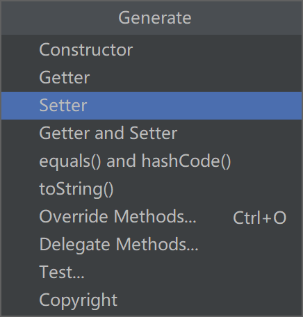
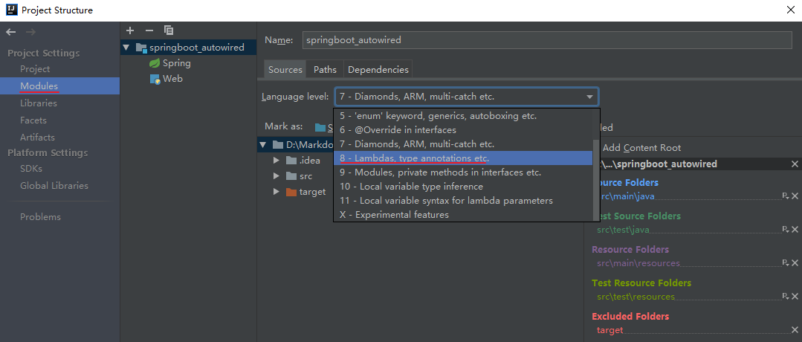
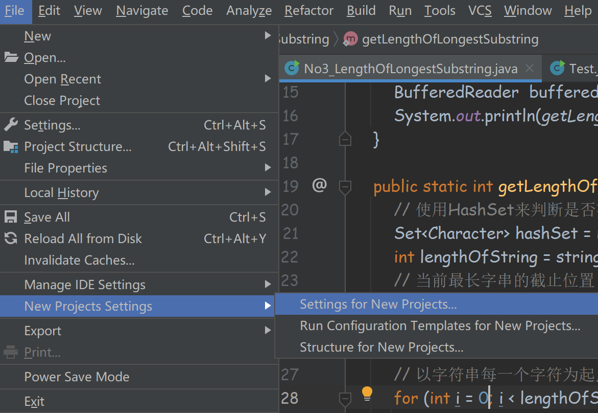
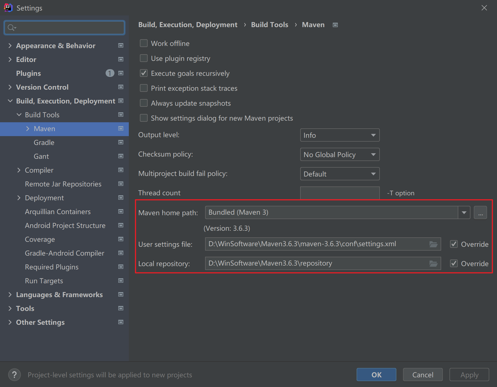
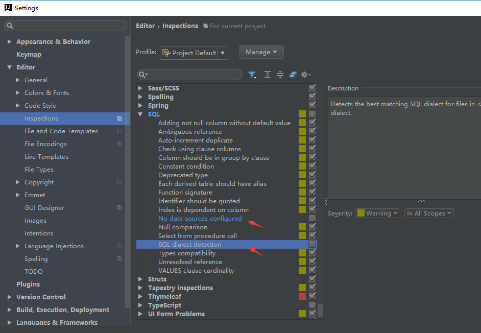
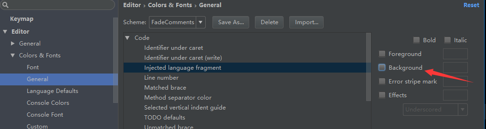
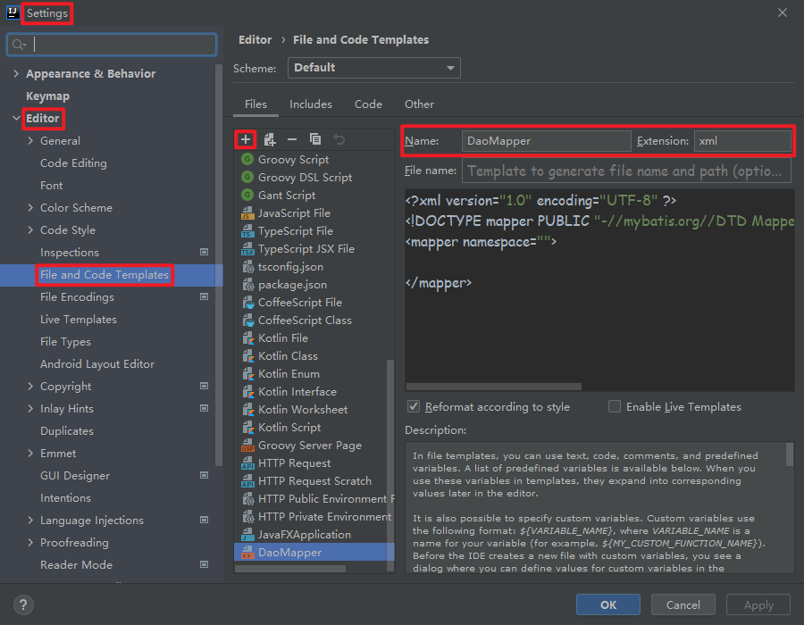
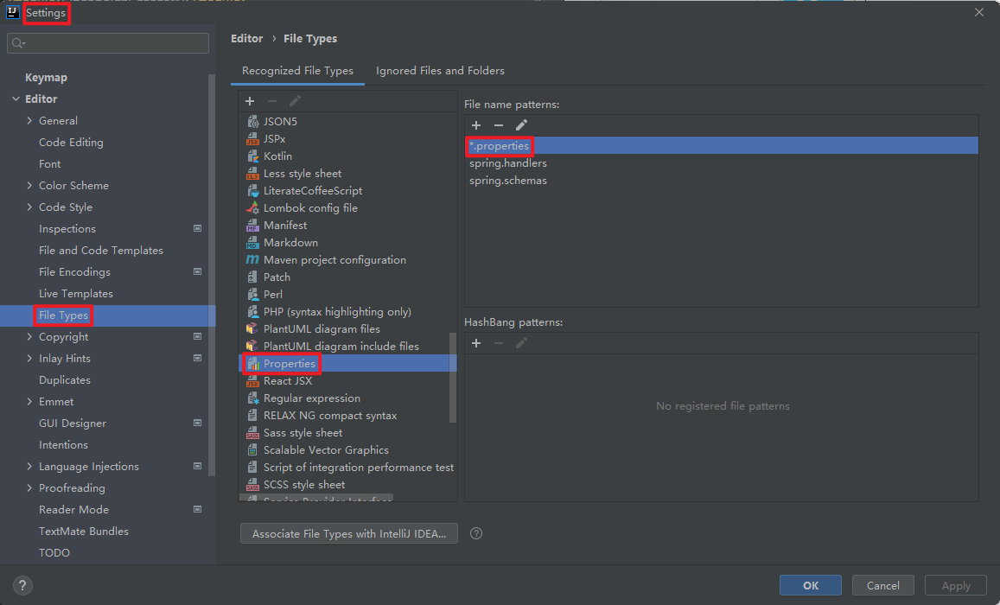
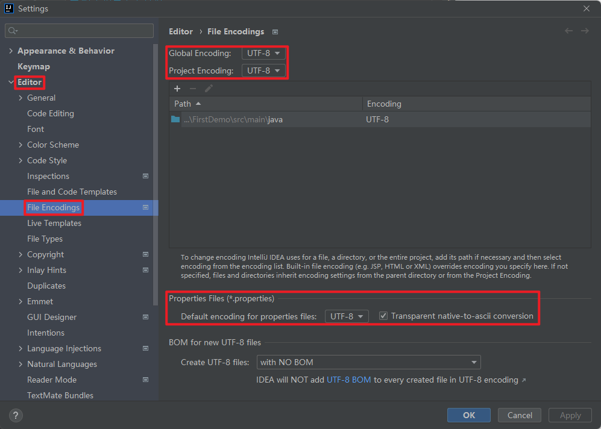

# 快捷键

## 生成Get/Set方法快捷键

`Alt + Ins`(Insert)



快捷输入

```java
String sessionCode = (String) session.getAttribute("validateCode");
```


```java
session.getAttribute("validateCode").cas
```


# 配置

## 使用Lambda表达式

使用了`Lambda`表达式，`IDEA`报错：`Lambda expressions are not supported at language level '7'`。需要在`Project Structure`中做以下修改：




## IDEA每次打开新的Maven项目都需要重新配置



设置`Maven`相关地址：




## IDEA去除xml文件sql语句背景色

Step 1：Settings $\rightarrow$ Editor$\rightarrow$ Inspections $\rightarrow$ SQL $\rightarrow$ `No data sources configure`取消勾选

Step 2：Settings $\rightarrow$ Editor $\rightarrow$ Inspections $\rightarrow$ SQL $\rightarrow$ `SQL dialect detection`取消勾选



Step 3：Settings $\rightarrow$ Editor $\rightarrow$ Color Scheme $\rightarrow$ General $\rightarrow$ Code $\rightarrow$ `Injected language fragment`去掉`Background`勾选



## 创建mapper.xml模板



## propertie图标变灰色且无代码提示



## 设置编码



