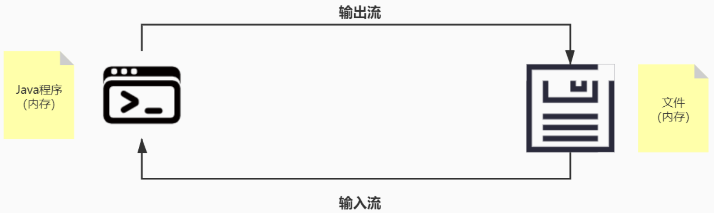
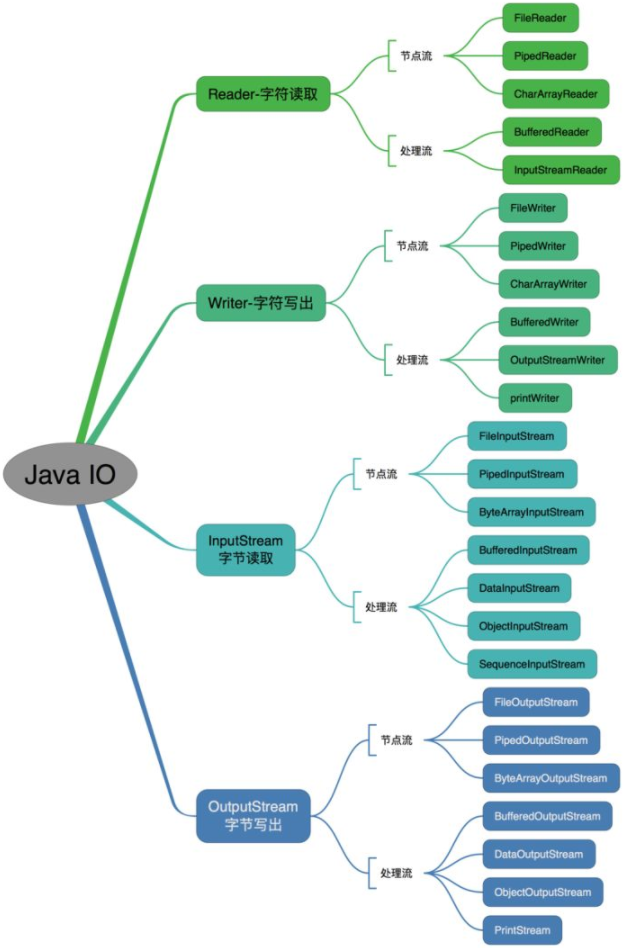
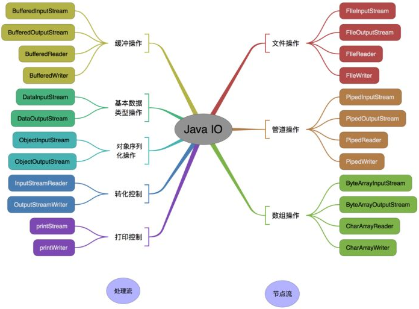
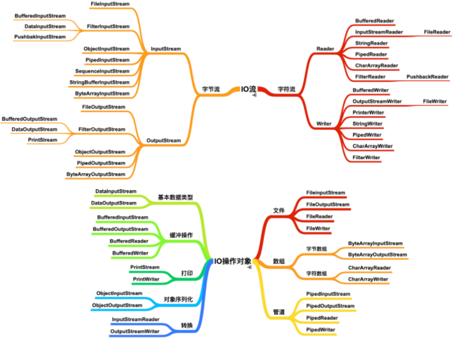

# 文件基础知识



- 流：数据在文件（数据源）和程序（内存）之间经历的路径。
- 输入流：数据从文件（数据源）到程序（内存）的路径。
- 输出流：数据从程序（内存）到数据源（文件）的路径。

注：输入和输出是基于程序（内存）的！

I/O 是 Input/Output 的缩写，I/O 技术用于处理数据传输，如读/写文件，网络通讯等。

流的本质是对文件的处理。Java程序中，对于数据的输入/输出操作以“流（Stream）”的方式进行。
`java.io`包下提供各种“流”类和接口，用来获取不同种类的数据，并通过方法输入或输出数据。

## 搭建环境

创建`Empty Project（HelloIOStream）`，创建`Module（CreateFile）`

### 引入依赖

```xml
<dependencies>
    <!-- https://mvnrepository.com/artifact/ch.qos.logback/logback-classic -->
    <dependency>
        <groupId>ch.qos.logback</groupId>
        <artifactId>logback-classic</artifactId>
        <version>1.2.3</version>
    </dependency>

    <!-- https://mvnrepository.com/artifact/org.junit.jupiter/junit-jupiter-api -->
    <dependency>
        <groupId>org.junit.jupiter</groupId>
        <artifactId>junit-jupiter-api</artifactId>
        <version>5.7.0</version>
    </dependency>
</dependencies>
```

### 日志配置文件

```xml
<?xml version="1.0" encoding="UTF-8"?>
<configuration debug="false">

    <!--定义日志文件的存储地址：当前项目HelloIOStream下log文件夹-->
    <property name="LOG_HOME" value="log" />

    <!--控制台日志， 控制台输出 -->
    <appender name="CONSOLE" class="ch.qos.logback.core.ConsoleAppender">
        <encoder class="ch.qos.logback.classic.encoder.PatternLayoutEncoder">
            <!--格式化输出：%d表示日期，%thread表示线程名，%-5level：级别从左显示5个字符宽度，%msg：日志消息，%n是换行符-->
            <pattern>%d{yyyy-MM-dd HH:mm:ss.SSS} [%thread] %-5level %logger{50} - %msg%n</pattern>
        </encoder>
    </appender>

    <!--文件日志， 按照每天生成日志文件 -->
    <appender name="FILE" class="ch.qos.logback.core.rolling.RollingFileAppender">
        <rollingPolicy class="ch.qos.logback.core.rolling.TimeBasedRollingPolicy">
            <!--日志文件输出的文件名-->
            <FileNamePattern>${LOG_HOME}/HelloIOStream.%d{yyyy-MM-dd}.log</FileNamePattern>
            <!--日志文件保留天数-->
            <MaxHistory>30</MaxHistory>
        </rollingPolicy>

        <encoder class="ch.qos.logback.classic.encoder.PatternLayoutEncoder">
            <!--格式化输出：%d表示日期，%thread表示线程名，%-5level：级别从左显示5个字符宽度，%msg：日志消息，%n是换行符-->
            <pattern>%d{yyyy-MM-dd HH:mm:ss.SSS} [%thread] %-5level %logger{50} - %msg%n</pattern>
        </encoder>

        <!--日志文件最大的大小-->
        <triggeringPolicy class="ch.qos.logback.core.rolling.SizeBasedTriggeringPolicy">
            <MaxFileSize>10MB</MaxFileSize>
        </triggeringPolicy>
    </appender>

    <!-- 日志输出级别 -->
    <root level="DEBUG">
        <appender-ref ref="CONSOLE" />
        <appender-ref ref="FILE"/>
    </root>
</configuration>
```

## 创建文件

```java
// Creates a new File instance by converting the given pathname string into an abstract pathname.
new File(String pathname)

// Creates a new File instance from a parent pathname string and a child pathname string.
new File(String parent, String child)

// Creates a new File instance from a parent abstract pathname and a child pathname string.
new File(File parent, String child)
```

### 创建文件的三种方式

```java
import org.junit.jupiter.api.Test;
import org.slf4j.Logger;
import org.slf4j.LoggerFactory;

import java.io.File;
import java.io.IOException;

/**
 * @author chenzufeng
 * @date 2021/11/6
 * @usage FileCreate
 */
public class FileCreate {
    private static Logger logger = LoggerFactory.getLogger(FileCreate.class);

    public static void main(String[] args) throws IOException {
        // 当前设置只有在main函数中调用，才会保存log
    }

    /**
     * Creates a new File instance by converting the given pathname string into an abstract pathname.
     * @throws IOException IOException
     */
    @Test
    public void createMethod1() throws IOException {
        String pathName = "D:\\Learning\\BackendDevelop\\Java\\JavaCode\\HelloIOStream\\log\\createMethod1.txt";

        File file = new File(pathName);
        file.createNewFile();
        logger.info("createMethod1文件创建成功！");
    }

    /**
     * Creates a new File instance from a parent abstract pathname and a child pathname string.
     * @throws IOException IOException
     */
    @Test
    public void createMethod2() throws IOException {
        String parentPath = "D:\\Learning\\BackendDevelop\\Java\\JavaCode\\HelloIOStream\\log";
        String childPath = "createMethod2.txt";

        File file = new File(parentPath, childPath);
        file.createNewFile();
        logger.info("createMethod2文件创建成功！");
    }

    /**
     * Creates a new File instance from a parent abstract pathname and a child pathname string.
     * @throws IOException IOException
     */
    @Test
    public void createMethod3() throws IOException {
        String parentAbstractPathName = "D:\\Learning\\BackendDevelop\\Java\\JavaCode\\HelloIOStream\\log";
        File parentFile = new File(parentAbstractPathName);
        String childPathName = "createMethod3.txt";

        File file = new File(parentFile, childPathName);

        file.createNewFile();
        logger.info("createMethod3文件创建成功！");
    }
}
```

### 获取文件信息

```java
import org.junit.jupiter.api.Test;
import org.slf4j.Logger;
import org.slf4j.LoggerFactory;

import java.io.File;
import java.io.IOException;

/**
 * @author chenzufeng
 * @date 2021/11/6
 * @usage FileCreate
 */
public class FileCreate {
    private static Logger logger = LoggerFactory.getLogger(FileCreate.class);

    public static void main(String[] args) throws IOException {
        // 当前设置只有在main函数中调用，才会保存log
    }

    /**
     * 获取文件信息
     */
    @Test
    public void getFileInfo() {
        // 先创建文件对象
        String filePath = "D:\\Learning\\BackendDevelop\\Java\\JavaCode\\HelloIOStream\\log\\createMethod1.txt";
        File file = new File(filePath);

        // 调用方法获取信息
        logger.info("文件名：{}", file.getName());
        logger.info("文件绝对路径：{}", file.getAbsoluteFile());
        logger.info("文件父级目录：{}", file.getParent());
        logger.info("文件大小（字节）：{}", file.length());
        logger.info("文件是否存在：{}", file.exists());
        logger.info("是不是一个文件：{}", file.isFile());
        logger.info("是不是一个目录：{}", file.isDirectory());
    }
}
```

输出：

```markdown
2021-11-06 15:48:18.404 [main] INFO  FileCreate - 文件名：createMethod1.txt
2021-11-06 15:48:18.410 [main] INFO  FileCreate - 文件绝对路径：D:\Learning\BackendDevelop\Java\JavaCode\HelloIOStream\log\createMethod1.txt
2021-11-06 15:48:18.410 [main] INFO  FileCreate - D:\Learning\BackendDevelop\Java\JavaCode\HelloIOStream\log\createMethod1.txt
2021-11-06 15:48:18.411 [main] INFO  FileCreate - 文件父级目录：D:\Learning\BackendDevelop\Java\JavaCode\HelloIOStream\log
2021-11-06 15:48:18.411 [main] INFO  FileCreate - 文件大小（字节）：0
2021-11-06 15:48:18.411 [main] INFO  FileCreate - 文件是否存在：false
2021-11-06 15:48:18.411 [main] INFO  FileCreate - 是不是一个文件：false
2021-11-06 15:48:18.411 [main] INFO  FileCreate - 是不是一个目录：false
```

# 流的分类

- 按照流的==流向==划分，可分为==输入流==和==输出流==（输出输入都是站在==程序所在内存==的角度划分的）：
  - 输入流：主要由InputStream和Reader作为基类；
  - 输出流：主要由outputStream和Writer作为基类。

- 按照==操作单元==划分，可分为==字节流==和==字符流==：
  - 字节流：以字节为单元，可操作任何数据，主要由InputStream和outPutStream作为基类；
  - 字符流：以字符为单元，只能操作纯字符数据，主要由Reader和Writer作为基类。

- 按照==流的角色==划分，可分为==节点流==和==处理流==：
  - 节点流：可以从/向一个特定的IO设备（如磁盘，网络）读/写数据的流，也叫【低级流】；
  - 处理流：用于对一个已存在的流进行连接和封装，通过封装后的流来实现数据的读/写功能，也叫【高级流】

Java IO 流的40多个类都是从如下4个抽象类基类中派生出来的：

- InputStream/Reader：所有的==输入流==的基类，`InputStream` 是字节输入流，`Reader` 是字符输入流。

- OutputStream/Writer：所有==输出流==的基类，`OutputStream`是字节输出流，`Writer`是字符输出流。

## 按操作方式分类



## 按操作对象分类



## 按字符字节处理方式分类




# FileInputStream

<font color=red>在UTF-8下，一个英文字符是==1个字节==，一个汉字是==3个字节==</font>！

## 单个字节读取

```java
import org.junit.jupiter.api.Test;
import org.slf4j.Logger;
import org.slf4j.LoggerFactory;

import java.io.FileInputStream;
import java.io.IOException;
import java.util.Arrays;

/**
 * @author chenzufeng
 * @date 2021/11/6
 * @usage FileInputStreamTest
 */
public class FileInputStreamTest {
    private static Logger logger = LoggerFactory.getLogger(FileInputStreamTest.class);

    public static void main(String[] args) throws IOException {

    }

    /**
     * 单个字节的读取，效率比较低（##写法有问题##）
     * @throws IOException IOException
     */
    @Test
    public void readFileMethod1() throws IOException {
        String filePath = "D:\\Learning\\BackendDevelop\\Java\\JavaCode\\HelloIOStream\\IO流测试.txt";
        // 创建FileInputStream对象，用于读取文件
        FileInputStream fileInputStream = new FileInputStream(filePath);

        // 从该输入流读取一个字节的数据。如果没有输入，该方法终止；如果返回-1，表示读取完毕。
        int readData = fileInputStream.read();
        /*
         * int readLen = fileInputStream.read()——读到的是第一个字节的数据（I，对应73）
         * 那么readLen（73） != -1一直满足
         * 写法有问题！！！
         */
        while (readData != -1) {
            // 转成char显示——将72转为I
            logger.info("读取的数据：{}", (char) readData);
        }

        // 关闭文件流，释放资源
        fileInputStream.close();
    }

    /**
     * 单个字节的读取，效率比较低
     * @throws IOException IOException
     */
    @Test
    public void readFileMethod1_1() throws IOException {
        String filePath = "D:\\Learning\\BackendDevelop\\Java\\JavaCode\\HelloIOStream\\IO流测试.txt";
        int readData;
        // 1. 创建FileInputStream对象，用于读取文件
        FileInputStream fileInputStream = new FileInputStream(filePath);

        // 2. 从该输入流读取一个字节的数据。如果没有输入，该方法终止；如果返回-1，表示读取完毕。
        while ((readData = fileInputStream.read()) != -1) {
            // 转成char显示——将72转为I
            logger.info("读取的数据：{}", (char) readData);
        }

        // 关闭文件流，释放资源
        fileInputStream.close();
    }
}
```

`readFileMethod1_1`输出：

```markdown
17:08:24.147 [main] INFO FileInputStreamTest - 读取的数据：I
17:08:24.181 [main] INFO FileInputStreamTest - 读取的数据：O
17:08:24.182 [main] INFO FileInputStreamTest - 读取的数据：æ
17:08:24.184 [main] INFO FileInputStreamTest - 读取的数据：µ
17:08:24.184 [main] INFO FileInputStreamTest - 读取的数据：
17:08:24.184 [main] INFO FileInputStreamTest - 读取的数据：æ
17:08:24.184 [main] INFO FileInputStreamTest - 读取的数据：µ
17:08:24.184 [main] INFO FileInputStreamTest - 读取的数据：‹
17:08:24.184 [main] INFO FileInputStreamTest - 读取的数据：è
17:08:24.184 [main] INFO FileInputStreamTest - 读取的数据：¯
17:08:24.184 [main] INFO FileInputStreamTest - 读取的数据：
```

如果以字节的方式读取，可以看到，汉字出现乱码了。因为<font color=red>一个中文字符是3个字节，不能一个一个字节地读</font>！

## 使用 read(byte[] b) 读取文件

```java
import org.junit.jupiter.api.Test;
import org.slf4j.Logger;
import org.slf4j.LoggerFactory;

import java.io.FileInputStream;
import java.io.IOException;
import java.util.Arrays;

public class FileInputStreamTest {
    private static Logger logger = LoggerFactory.getLogger(FileInputStreamTest.class);

    public static void main(String[] args) throws IOException {

    }

    /**
     * 使用 read(byte[] b) 读取文件，提高效率
     * @throws IOException IOException
     */
    @Test
    public void readFileMethod2() throws IOException {
        String filePath = "D:\\Learning\\BackendDevelop\\Java\\JavaCode\\HelloIOStream\\IO流测试.txt";
        // 一次读取10个字节
        byte[] bytes = new byte[10];
        int readData;

        // 1. 创建FileInputStream对象，用于读取文件
        FileInputStream fileInputStream = new FileInputStream(filePath);
        // 2. 一次读取10个字节
        while ((readData = fileInputStream.read(bytes)) != -1) {
            logger.info("返回实际读取到字节数组中的字节数：{}", readData);
            logger.info("读取后的字节数组内容：{}", Arrays.toString(bytes));
            logger.info("读取的数据内容：{}", new String(bytes, 0, readData));
        }
        // 关闭文件流，释放资源
        fileInputStream.close();
    }
}
```

输出：

```markdown
17:10:02.845 [main] INFO FileInputStreamTest - 返回实际读取到字节数组中的字节数：10
17:10:02.851 [main] INFO FileInputStreamTest - 读取后的字节数组内容：[73, 79, -26, -75, -127, -26, -75, -117, -24, -81]
17:10:02.851 [main] INFO FileInputStreamTest - 读取的数据内容：IO流测�
17:10:02.851 [main] INFO FileInputStreamTest - 返回实际读取到字节数组中的字节数：1
17:10:02.851 [main] INFO FileInputStreamTest - 读取后的字节数组内容：[-107, 79, -26, -75, -127, -26, -75, -117, -24, -81]
17:10:02.851 [main] INFO FileInputStreamTest - 读取的数据内容：�
```

如果将字节数组的大小修改为8（`byte[] bytes = new byte[8]`）：

```markdown
17:10:33.355 [main] INFO FileInputStreamTest - 返回实际读取到字节数组中的字节数：8
17:10:33.359 [main] INFO FileInputStreamTest - 读取后的字节数组内容：[73, 79, -26, -75, -127, -26, -75, -117]
17:10:33.359 [main] INFO FileInputStreamTest - 读取的数据内容：IO流测
17:10:33.359 [main] INFO FileInputStreamTest - 返回实际读取到字节数组中的字节数：3
17:10:33.359 [main] INFO FileInputStreamTest - 读取后的字节数组内容：[-24, -81, -107, -75, -127, -26, -75, -117]
17:10:33.359 [main] INFO FileInputStreamTest - 读取的数据内容：试
```

用字节数组也不适合读取有中文字符的数据，数据`IO流测试`一共11个字节（`IO流测`一共8个字节），如果设置字节数组大小为10，那么就会无法读取最后一个汉字！

# FileOutputStream

```java
// Creates a file output stream to write to the file with the specified name. A new FileDescriptor object is created to represent this file connection.
// 当写入内容时，会覆盖原来的内容
new FileOutputStream(String name)

// Creates a file output stream to write to the file with the specified name. If the second argument is true, then bytes will be written to the end of the file rather than the beginning. A new FileDescriptor object is created to represent this file connection. 
// 当写入内容时，会追加到文件后面
new FileOutputStream(String name, boolean append)
```

## 保存字符串

```java
import org.junit.jupiter.api.Test;
import org.slf4j.Logger;
import org.slf4j.LoggerFactory;

import java.io.FileOutputStream;
import java.io.IOException;

/**
 * @author chenzufeng
 * @date 2021/11/6
 * @usage FileOutputStreamTest 将数据写到文件中
 */
public class FileOutputStreamTest {
    private static Logger logger = LoggerFactory.getLogger(FileOutputStreamTest.class);

    /**
     * 将数据写到文件中，如果该文件不存在，则创建
     * @throws IOException IOException
     */
    @Test
    public void writeFile() throws IOException {
        String filePath = "D:\\Learning\\BackendDevelop\\Java\\JavaCode\\HelloIOStream\\IO流测试.txt";
        // 1. 创建对象，写入文件路径
        FileOutputStream fileOutputStream = new FileOutputStream(filePath, true);
        String appendStr = "\nFileOutputStreamTest类";
        // 2. 字节数组写入输出流中（getBytes把字符串转换成字节数组）
        fileOutputStream.write(appendStr.getBytes());
        fileOutputStream.close();
    }
}
```

## 拷贝图片

```java
import org.junit.jupiter.api.Test;
import org.slf4j.Logger;
import org.slf4j.LoggerFactory;

import java.io.FileInputStream;
import java.io.FileOutputStream;
import java.io.IOException;

public class FileOutputStreamTest {
    private static Logger logger = LoggerFactory.getLogger(FileOutputStreamTest.class);

    /**
     * 拷贝图片
     * @throws IOException IOException
     */
    @Test
    public void copyPicture() throws IOException {
        String srcFilePath = "C:\\Users\\chenzufeng\\Pictures\\Saved Pictures\\冰山.jpg";
        String destFilePath = "D:\\Learning\\BackendDevelop\\Java\\JavaCode\\HelloIOStream\\冰山1.jpg";

        // 1. 创建输入流，读入文件
        FileInputStream fileInputStream = new FileInputStream(srcFilePath);
        // 2. 创建输出流，写入文件
        FileOutputStream fileOutputStream = new FileOutputStream(destFilePath);
        // 3. 定义字节数组，提高读取速度
        byte[] buffer = new byte[1024];

        int readData;
        while ((readData = fileInputStream.read(buffer)) != -1) {
            // 4. 读取到数据后，立即写入文件
            fileOutputStream.write(buffer, 0, readData);
            /*
             * public void write(byte b[], int off, int len) throws IOException {
             *      writeBytes(b, off, len, append);
             * }
             *
             * Writes len bytes from the specified byte array starting at offset off to this file output stream.
             * Params:
             *          b – the data.
             *          off – the start offset in the data.
             *          len – the number of bytes to write.
             * Throws:
             *          IOException – if an I/O error occurs.
             * "\n"算一个字节
             */
        }
        logger.info("数据拷贝成功！");

        // 5. 关闭输入、输出流，释放资源
        fileInputStream.close();
        fileOutputStream.close();
    }
}
```

# FileReader

## 单个字符读取文件

```java
import org.junit.jupiter.api.Test;
import org.slf4j.Logger;
import org.slf4j.LoggerFactory;

import java.io.FileReader;
import java.io.IOException;

/**
 * @author chenzufeng
 * @date 2021/11/7
 * @usage FileReaderTest
 */
public class FileReaderTest {
    private static Logger logger = LoggerFactory.getLogger(FileReaderTest.class);

    /**
     * 单个字符读取文件
     */
    @Test
    public void readFileMethod1() {
        String filePath = "D:\\Learning\\BackendDevelop\\Java\\JavaCode\\HelloIOStream\\IO流测试.txt";
        FileReader fileReader = null;
        int readData = 0;

        try {
            // 1. 创建FileReader对象
            fileReader = new FileReader(filePath);
            // 2. 循环读取数据：使用read()读取单个字符
            while ((readData = fileReader.read()) != -1) {
                logger.info("读取的数据为：{}", (char) readData);
            }
        } catch (IOException e) {
            e.printStackTrace();
        } finally {
            try {
                if (fileReader != null) {
                    // 3. 关闭数据流
                    fileReader.close();
                }
            } catch (IOException e) {
                e.printStackTrace();
            }
        }
    }
}
```

输出结果：

```markdown
00:49:05.570 [main] INFO FileReaderTest - 读取的数据为：I
00:49:05.570 [main] INFO FileReaderTest - 读取的数据为：O
00:49:05.570 [main] INFO FileReaderTest - 读取的数据为：流
00:49:05.570 [main] INFO FileReaderTest - 读取的数据为：测
00:49:05.570 [main] INFO FileReaderTest - 读取的数据为：试
00:49:05.570 [main] INFO FileReaderTest - 读取的数据为：

00:49:05.570 [main] INFO FileReaderTest - 读取的数据为：F
00:49:05.570 [main] INFO FileReaderTest - 读取的数据为：i
00:49:05.570 [main] INFO FileReaderTest - 读取的数据为：l
00:49:05.570 [main] INFO FileReaderTest - 读取的数据为：e
00:49:05.570 [main] INFO FileReaderTest - 读取的数据为：O
00:49:05.570 [main] INFO FileReaderTest - 读取的数据为：u
00:49:05.570 [main] INFO FileReaderTest - 读取的数据为：t
00:49:05.570 [main] INFO FileReaderTest - 读取的数据为：p
00:49:05.570 [main] INFO FileReaderTest - 读取的数据为：u
00:49:05.570 [main] INFO FileReaderTest - 读取的数据为：t
00:49:05.570 [main] INFO FileReaderTest - 读取的数据为：S
00:49:05.570 [main] INFO FileReaderTest - 读取的数据为：t
00:49:05.570 [main] INFO FileReaderTest - 读取的数据为：r
00:49:05.570 [main] INFO FileReaderTest - 读取的数据为：e
00:49:05.570 [main] INFO FileReaderTest - 读取的数据为：a
00:49:05.570 [main] INFO FileReaderTest - 读取的数据为：m
00:49:05.570 [main] INFO FileReaderTest - 读取的数据为：T
00:49:05.570 [main] INFO FileReaderTest - 读取的数据为：e
00:49:05.570 [main] INFO FileReaderTest - 读取的数据为：s
00:49:05.570 [main] INFO FileReaderTest - 读取的数据为：t
00:49:05.570 [main] INFO FileReaderTest - 读取的数据为：类
```

## 字符数组读取文件

```java
import org.junit.jupiter.api.Test;
import org.slf4j.Logger;
import org.slf4j.LoggerFactory;

import java.io.FileNotFoundException;
import java.io.FileReader;
import java.io.IOException;

/**
 * @author chenzufeng
 * @date 2021/11/7
 * @usage FileReaderTest
 */
public class FileReaderTest {
    private static Logger logger = LoggerFactory.getLogger(FileReaderTest.class);

    /**
     * 单个字符读取文件
     */
    @Test
    public void readFileMethod1() {
        String filePath = "D:\\Learning\\BackendDevelop\\Java\\JavaCode\\HelloIOStream\\IO流测试.txt";
        FileReader fileReader = null;
        int readData = 0;

        try {
            // 1. 创建FileReader对象
            fileReader = new FileReader(filePath);
            // 2. 循环读取数据：使用read()读取单个字符
            while ((readData = fileReader.read()) != -1) {
                logger.info("读取的数据为：{}", (char) readData);
            }
        } catch (IOException e) {
            e.printStackTrace();
        } finally {
            try {
                if (fileReader != null) {
                    // 3. 关闭数据流
                    fileReader.close();
                }
            } catch (IOException e) {
                e.printStackTrace();
            }
        }
    }

    /**
     * 字符数组读取文件
     */
    @Test
    public void readFileMethod2() {
        String filePath = "D:\\Learning\\BackendDevelop\\Java\\JavaCode\\HelloIOStream\\IO流测试.txt";
        int readData = 0;
        char[] bytes = new char[16];
        FileReader fileReader = null;

        try {
            // 1. 创建FileReader对象
            fileReader = new FileReader(filePath);
            // 2. 循环读取：使用read(bytes)，返回实际读取到的字符数。如果返回-1，读取文件结束
            while ((readData = fileReader.read(bytes)) != -1) {
                logger.info("读取的数据为：{}", new String(bytes, 0, readData));
            }
        } catch (IOException e) {
            e.printStackTrace();
        } finally {
            try {
                if (fileReader != null) {
                    fileReader.close();
                }
            } catch (IOException e) {
                e.printStackTrace();
            }
        }
    }
}
```

输出结果：

```java
00:58:20.688 [main] INFO FileReaderTest - 读取的数据为：IO流测试
FileOutput
00:58:20.688 [main] INFO FileReaderTest - 读取的数据为：StreamTest类
```

# FileWriter

```java
```


# 参考资料

## 视频

[韩顺平-Java IO 流](https://www.bilibili.com/video/BV15B4y1u7Rn?p=1)

## 笔记

[韩顺平-Java IO 流-笔记1](https://itkxz.cn/2021/01/08/JavaIO%E6%B5%81%E5%AD%A6%E4%B9%A0%E7%AC%94%E8%AE%B0/)

[韩顺平-Java IO 流-笔记2](https://blog.csdn.net/ningmengshuxiawo/article/details/119102854)

https://blog.csdn.net/yczz/article/details/38761237

https://10veu.github.io/2021/09/11/Java%20IO%E6%B5%81/

[IO流分类](https://ca3tie1.github.io/post/java-io-tips/)

https://zhuanlan.zhihu.com/p/98094713