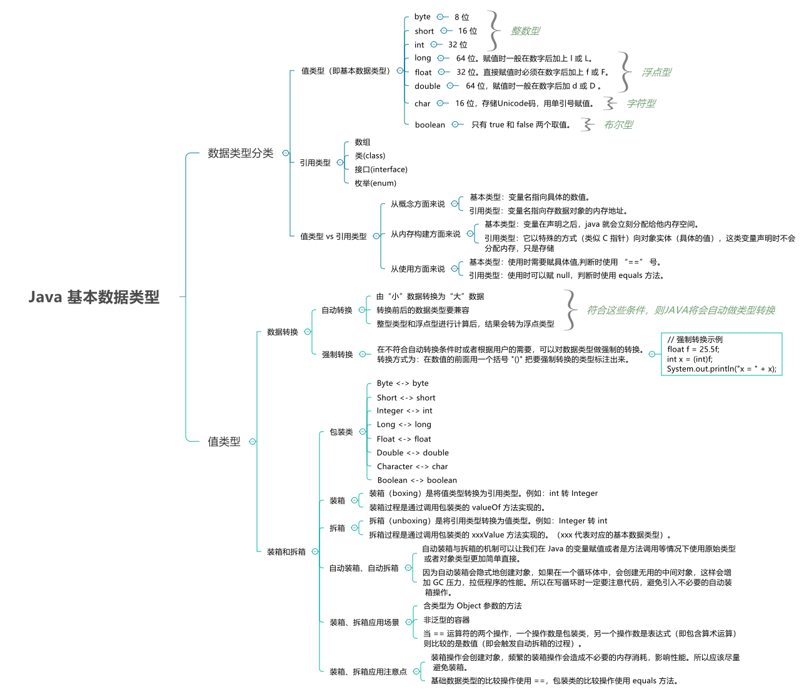
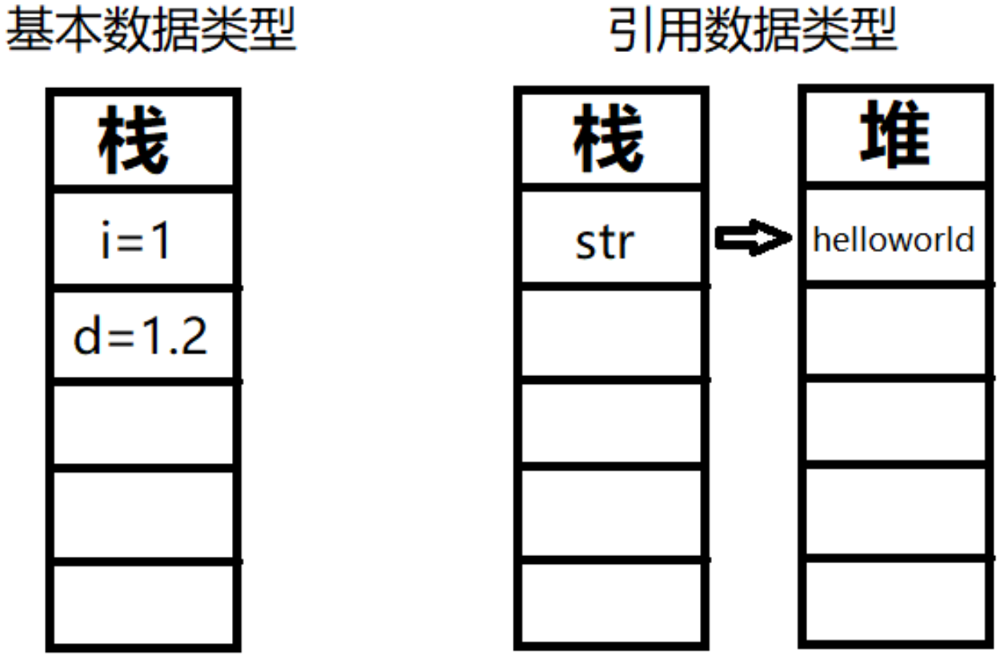
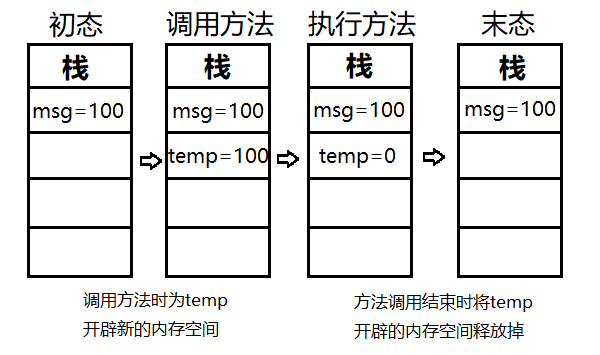
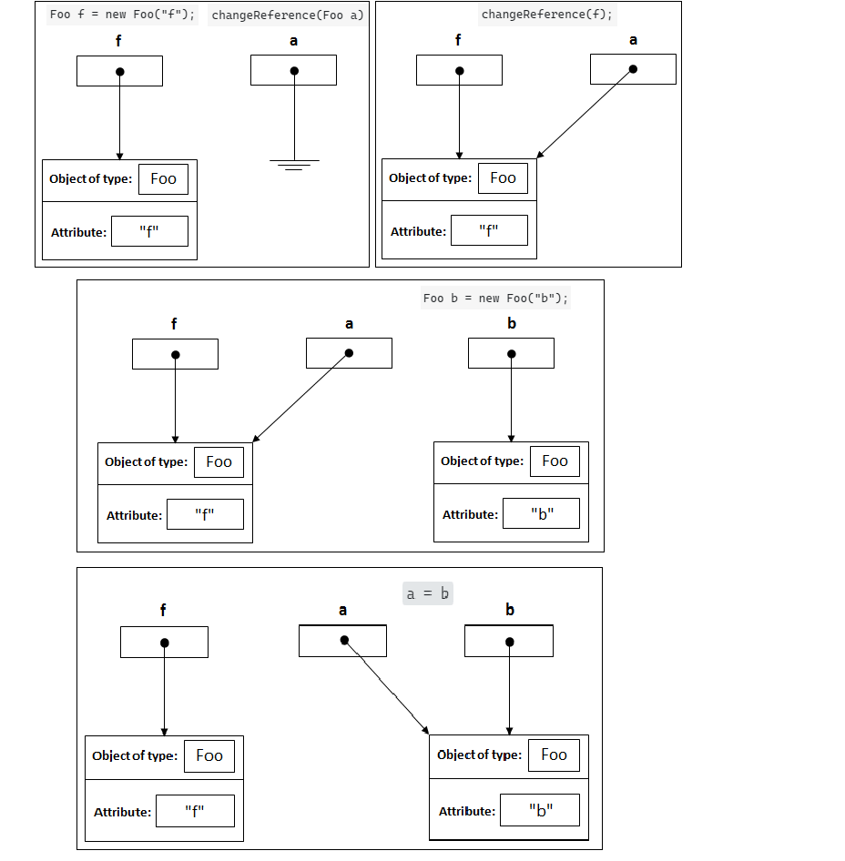
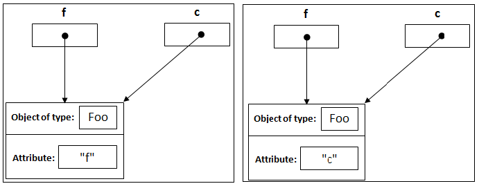

# 基本数据类型概览

在 Java 中，==对象==是存储在==堆==里的，通过==栈==中的==引用==来使用这些对象。所以，对象是比较消耗资源的。

对于==经常用到的类型==，如 int 等，如果每次使用这种变量的时候都需要 new 一个 Java 对象的话，就会比较笨重。所以，和 C++ 一样，Java 提供了==基本数据类型==，这种数据的变量不需要使用 new 创建，他们不会在堆上创建，而是==直接在栈内存中存储==，因此会更加高效。



# 数据类型分类

Java 中的数据类型有两类：

- 值类型（又叫内置数据类型，==基本数据类型==）
- 引用类型（除值类型以外，都是引用类型，包括 `String`、数组）

##  值类型

Java 语言提供了 **8** 种==基本类型==，大致分为 **4** 类

| 基本数据类型 | 分类       | 比特数 | 默认值     | 取值范围                      | 说明                              |
| ------------ | ---------- | ------ | ---------- | ----------------------------- | --------------------------------- |
| `boolean`    | **布尔型** |        | `false`    | {false, true}                 |                                   |
| `char`       | **字符型** | 16 位  | `'\u0000'` | [0, $2^{16} - 1$]             | 存储 Unicode 码，用单引号赋值     |
| `byte`       | **整数型** | 8 位   | `0`        | [-$2^7$, $2^7 - 1$]           |                                   |
| `short`      | **整数型** | 16 位  | `0`        | [-$2^{15}$, $2^{15} - 1$]     |                                   |
| `int`        | **整数型** | 32 位  | `0`        | [-$2^{31}$, $2^{31} - 1$]     |                                   |
| `long`       | **整数型** | 64 位  | `0L`       | [-$2^{63}$, $2^{63} - 1$]     | 赋值时一般在数字后加上 `l` 或 `L` |
| `float`      | **浮点型** | 32 位  | `+0.0F`    | [$2^{-149}$, $2^{128} - 1$]   | 赋值时必须在数字后加上 `f` 或 `F` |
| `double`     | **浮点型** | 64 位  | `+0.0D`    | [$2^{-1074}$, $2^{1024} - 1$] | 赋值时一般在数字后加 `d` 或 `D`   |

尽管各种数据类型的默认值看起来不一样，但在内存中都是 0。

在这些基本类型中，`boolean` 和 `char` 是唯二的无符号类型。

### 布尔型大小

https://cloud.tencent.com/developer/article/1552613

https://zhuanlan.zhihu.com/p/106203868

布尔数据类型只有两个可能的==值==：真和假。使用此数据类型为跟踪真/假条件的简单标记，**但是它的“大小”并不是精确定义**。

Java规范中，没有明确指出boolean的大小。在《Java虚拟机规范》给出了==单个boolean占4个字节==，和==boolean数组占1个字节==的定义，具体**还要看虚拟机实现是否按照规范来**。

即，Java语言表达式所操作的boolean值，在编译之后都使用Java虚拟机中的int数据类型来代替，也就是4个字节；而boolean数组将会被编码成Java虚拟机的byte数组，此时为1个字节。所以，boolean类型单独使用时，占了4个字节，在数组中是1个字节。

## 值类型和引用类型的区别

概念

- 基本类型：变量名指向==具体的数值==。
- 引用类型：变量名指向存数据对象的==内存地址==。

内存

- 基本类型：变量在声明之后，Java 就会==立刻分配内存空间==。
- 引用类型：它以特殊的方式（类似 C 指针）指向对象实体（具体的值），这类变量在声明时==不会分配内存==，只是存储了一个==内存地址==。

使用

- 基本类型：使用时需要==赋具体值==，判断时使用 `==` 号。
- 引用类型：使用时可以==赋 null==，判断时使用 `equals` 方法（使用 `==` 号比较的是地址）。


### 存储位置

https://www.cnblogs.com/maskwolf/p/9972982.html

基本变量类型

- 在方法中，定义的非全局基本数据类型变量，其具体内容是存储在==栈==中

引用变量类型

- 只要是引用数据类型变量，其==具体内容==都是存放在==堆==中；而==栈==中存放的是其==具体内容所在内存的地址==。通过变量地址可以找到变量的具体内容，就如同通过房间号可以找到房间一般。


```java
public class Main {
   public static void main(String[] args) {
       // 基本数据类型
       int i = 1;
       double d = 1.2;
       // 引用数据类型
       String str = "helloworld";
   }
}
```



### 按值传递

https://www.cnblogs.com/maskwolf/p/9972982.html


> **The Java Spec says that everything in Java is pass-by-value. There is no such thing as “pass-by-reference” in Java.**

#### 基本数据类型按值传递

```java
public class Main {
   public static void main(String[] args) {
       int msg = 100;
       System.out.println("调用方法前msg的值：\n" + msg);    // 100
       fun(msg);
       System.out.println("调用方法后msg的值：\n" + msg);    // 100
   }
   public static void fun(int temp){
       temp = 0;
   }
}
```



```java
public class Swap {
    public static void main(String[] args) {
        int x = 10;
        int y = 20;
        swap(x, y);
        System.out.println("x(2) = " + x);
        System.out.println("y(2) = " + y);
    }
    
     public static void swap(int x, int y) {
        int temp = x;
        x = y;
        y = temp;
        System.out.println("x(1) = " + x);
        System.out.println("y(1) = " + y);
    }
}

/*输出
x(1) = 20
y(1) = 10
x(2) = 10
y(2) = 20
*/
```

#### 引用数据类型按值传递

https://blog.csdn.net/u013309870/article/details/75499175

引用类型的按值传递，传递的是==对象的地址==。

```java
public class Main {
     public static void main(String[] args) {
          Foo f = new Foo("f");
          changeReference(f); // It won't change the reference!
          modifyReference(f); // It will modify the object that the reference variable "f" refers to!
     }

     public static void changeReference(Foo a) {
          Foo b = new Foo("b");
          a = b;
     }

     public static void modifyReference(Foo c) {
          c.setAttribute("c");
     }
}
```



调用`c.setAttribute("c")`：



```java
class Book {
    String name;
    double price;

    public Book(String name,double price) {
        this.name = name;
        this.price = price;
    }
    public void getInfo(){
        System.out.println("图书名称："+ name + "，价格：" + price);
    }

    public void setPrice(double price) {
        this.price = price;
    }
}

public class Main{
   public static void main(String[] args) {
       Book book = new Book("Java开发指南",66.6);
       book.getInfo();  //图书名称：Java开发指南，价格：66.6
       fun(book);
       book.getInfo();  //图书名称：Java开发指南，价格：99.9
   }

   public static void fun(Book temp) {
       temp.setPrice(99.9);
   }
}
```

调用时为temp在栈中开辟新空间，并指向book的具体内容，方法执行完毕后temp在栈中的内存被释放掉：


# 数据转换

Java 中，数据类型转换有两种方式：

- 自动转换
- 强制转换

## 自动转换

Java 允许用户对基本类型做**有限度**的类型转换，如果符合以下条件，Java 将会自动做类型转换：

- **由小数据转换为大数据**

  显而易见的是，“小”数据类型的数值表示范围 < “大”数据类型的数值表示范围，即精度 < “大”数据类型。

  所以，如果“大”数据向“小”数据转换，会丢失数据精度。比如：long 转为 int，则超出 int 表示范围的数据将会丢失，导致结果的不确定性。

  反之，“小”数据向“大”数据转换，则不会存在数据丢失情况。由于这个原因，这种类型转换也称为**扩大转换**。

  这些类型由“小”到“大”分别为：(byte，short，char) < int < long < float < double。

  这里我们所说的“大”与“小”，并不是指占用字节的多少，而是指表示==值的范围==的大小。

  

- **转换前后的数据类型要兼容**

  由于 boolean 类型只能存放 true 或 false，这与整数或字符是不兼容的，因此不可以做类型转换。

  

- **整型类型和浮点型进行计算后，结果会转为浮点类型**


示例：

```java
long x = 30;
float y = 14.3f;
System.out.println("x/y = " + x/y);
```

输出：

```
x/y = 1.9607843
```

可见 long 虽然精度大于 float 类型，但是结果为浮点数类型。


## 强制转换

在不符合自动转换条件时或者根据用户的需要，可以对数据类型做强制的转换。**强制转换使用括号 `()` 。**

引用类型也可以使用强制转换。

示例：

```java
float f = 25.5f;
int x = (int) f;
System.out.println("x = " + x);
```


# 包装类型

[Java自动装箱与自动拆箱以及拆箱空指针问题](https://blog.csdn.net/sunshunli/article/details/111088467)

Java 语言是一个面向对象的语言，但是 Java 中的基本数据类型却是不面向对象的，这在实际使用时存在很多的不便，例如，无法将 int 、double 等类型放入集合类中。因为==集合的容器要求元素是 Object 类型==。为了解决这个不足，在设计类时为每个基本数据类型设计了一个对应的类进行代表，这样八个和基本数据类型对应的类统称为==包装类==（Wrapper Class）。

| 基本数据类型 | 包装类    |
| ------------ | --------- |
| byte         | Byte      |
| boolean      | Boolean   |
| short        | Short     |
| char         | Character |
| int          | Integer   |
| long         | Long      |
| float        | Float     |
| double       | Double    |

包装类型让基本类型具有了对象的特征，并且为其添加了属性和方法，丰富了基本类型的操作。使得**基本数据类型可以与引用类型互相转换**。

## 装箱与拆箱

在 Java SE5 中，为了减少开发人员的工作，Java 提供了自动拆箱与自动装箱功能。

JDK 5 之前的形式：

```java
Integer i1 = new Integer(10); // 非自动装箱
```

JDK 5 之后：

```java
Integer i2 = 10; // 自动装箱
```

> Java 对于自动装箱和拆箱的设计，依赖于一种叫做享元模式的设计模式

- 自动装箱
  - 将基本数据类型自动转换成对应的包装类（基本数据类型$\rightarrow$包装类）。即**将值类型转换为引用类型**，例如：`int` 转 `Integer`。
  - 装箱过程是通过调用包装类的 `valueOf` 方法实现的。
- 自动拆箱
  - 将包装类自动转换成对应的基本数据类型（包装类$\rightarrow$基本数据类型）。即**将引用类型转换为值类型**，例如：`Integer` 转 `int`。
  - 拆箱过程是通过调用包装类的 `xxxValue` 方法实现的。（xxx 代表对应的基本数据类型，如booleanValue()、longValue()等）。

```java
/**
 * 自动装箱、拆箱
 */
public class AutoBoxOrUnBox {
    public static void main(String[] args) {
        // 等价于 Integer i = new Integer(6);
        Integer i = 6;
        int j = i;
}
```

反编译后代码：

```java
public class AutoBoxOrUnBox {
    public static void main(String[] args) {
        // 自动装箱
        Integer i = Integer.valueOf(10);
        // 自动拆箱
        int j = i.intValue();
    }
}
```

因为自动装箱会隐式地创建对象，如果在一个循环体中，会创建无用的中间对象，这样会增加 GC 压力，拉低程序的性能。所以在写循环时一定要注意代码，避免引入不必要的自动装箱操作。

## 自动装箱、拆箱示例

### 将基本数据类型放入集合类

```java
import java.util.ArrayList;
 
/**
 * 自动装箱、拆箱
 */
public class AutoBoxOrUnBox {
    public static void main(String[] args) {
        Integer one = 1;
        Integer two = 2;
        ArrayList<Integer> arrayList = new ArrayList<>();
        arrayList.add(one); arrayList.add(two);
        for (Integer integer : arrayList) {
            System.out.println(integer);
        }
    }
}
```

反编译后代码：

```java
import java.util.ArrayList;
 
public class AutoBoxOrUnBox {
    public static void main(String[] args) {
        Integer one = Integer.valueOf(1);
        Integer two = Integer.valueOf(2);
        ArrayList<Integer> arrayList = new ArrayList<>();
        arrayList.add(one); arrayList.add(two);
        for (Integer integer : arrayList)
        	System.out.println(integer); 
    }
}
```

### 包装类型和基本类型的比较

```java
Integer a = 1;
System.out.println(a == 1 ? "等于" : "不等于");
Boolean bool = false;
System.out.println(bool ? "真" : "假");
```

反编译后代码：

```java
Integer a = 1;
System.out.println(a.intValue() == 1 ? "等于" : "不等于");
Boolean bool = false;
System.out.println(bool.booleanValue ? "真" : "假");
```

**包装类与基本数据类型的比较，会转换为基本数据类型的比较**：

```java
Integer i1 = 10; // 自动装箱
Integer i2 = new Integer(10); // 非自动装箱
Integer i3 = Integer.valueOf(10); // 非自动装箱
int i4 = new Integer(10); // 自动拆箱
int i5 = i2.intValue(); // 非自动拆箱
System.out.println("i1 = [" + i1 + "]"); // i1 = [10]
System.out.println("i2 = [" + i2 + "]"); // i2 = [10]
System.out.println("i3 = [" + i3 + "]"); // i3 = [10]
System.out.println("i4 = [" + i4 + "]"); // i4 = [10]
System.out.println("i5 = [" + i5 + "]"); // i5 = [10]
// i1 == i2 is [false]
System.out.println("i1 == i2 is [" + (i1 == i2) + "]");
// i1 == i4 is [true]
System.out.println("i1 == i4 is [" + (i1 == i4) + "]"); // 自动拆箱
```

为何会出现 `i1 == i2 is [false]` 而 `i1 == i4 is [true]` ？原因在于：

- i1、i2 都是包装类，使用 `==` 时，Java 将它们当做两个对象，而非两个 int 值来比较，所以两个对象自然是不相等的。正确的比较操作应该使用 `equals` 方法。
- i1 是包装类，i4 是基础数据类型，使用 `==` 时，Java 会将 i1 这个包装类对象自动拆箱为一个 `int` 值，再代入到 `==` 运算表达式中计算；最终，相当于两个 `int` 进行比较，由于值相同，所以结果相等。

注意：

- `i2 == i3`？？
- `Integer i6 = 10; `，则`i1 == i6`？？


### 包装类型的运算

```java
import java.util.ArrayList;
 
/**
 * 自动装箱、拆箱
 */
public class AutoBoxOrUnBox {
    public static void main(String[] args) {
        Integer i = 1;
        Integer j = 2;
        int res = i + j;
        System.out.println(res);
    }
}
```

反编译后代码：

```java
package autoBox;
 
public class AutoBoxOrUnBox {
    public static void main(String[] args) {
        Integer i = Integer.valueOf(1);
        Integer j = Integer.valueOf(2);
        int res = i.intValue() + j.intValue();
        System.out.println(res);
    }
}
```

### 三目运算符的使用

```java
package autoBox;
 
public class AutoBoxOrUnBox {
    public static void main(String[] args) {
        boolean flag = true;
        Integer i = 0;
        int j = 1;
        int k = flag ? i : j;
        System.out.println(k);
    }
}
```

反编译后代码：

```java
package autoBox;
 
public class AutoBoxOrUnBox {
    public static void main(String[] args) {
        boolean flag = true;
        Integer i = Integer.valueOf(0);
        int j = 1;
        int k = flag ? i.intValue() : j;
        System.out.println(k);
    }
}
```

当第二，第三位操作数分别为==基本类型==和==对象==时，其中的<font color=red>对象就会拆箱为基本类型进行操作</font>（基本类型 : 对象 $\longrightarrow$ 基本类型 : 基本类型）。

例子中，第二位的 i 是一个包装类型的对象，而第三位的 j 是一个基本类型，所以会对包装类进行自动拆箱。<font color=red>如果这个时候 i 的值为 null，那么就会发生 NPE（自动拆箱导致空指针异常）。</font>

当第二位和第三位表达式都是包装类型的时候，该表达式的结果才是该包装类型；否则，<font color=red>只要有一个表达式的类型是基本数据类型，则表达式得到的结果都是基本数据类型</font>。如果结果不符合预期，那么编译器就会进行自动拆箱。

### 函数参与返回值

```java
// 自动拆箱
public int getNum(Integer num) {
    // num.intValue()
    return num;
}

// 自动装箱
public Integer getNum(int num) {
    // Integer.valueOf(num)
    return num;
}
```

### 包装类缓存

```java
public class AutoBoxOrUnBox {
    public static void main(String[] args) {
        Integer integer1 = 6;
        Integer integer2 = 6;

        if (integer1 == integer2) {
            System.out.println("integer1 == integer2"); // 正确
        }

        if (integer1 != integer2) {
            System.out.println("integer1 != integer2");
        }

        Integer integer3 = 200;
        Integer integer4 = 200;

        if (integer3 == integer4) {
            System.out.println("integer1 == integer2");
        }

        if (integer3 != integer4) {
            System.out.println("integer1 != integer2"); // 正确
        }
    }
}
```

<font color=red>integer1 和 integer2 对象的地址肯定是不一样的</font>，但是为什么会是这个结果呢？

在Java 5中，在 Integer 的操作上，引入了一个新功能来节省内存和提高性能。<font color=red>整型对象通过使用相同的对象引用实现了缓存和重用</font>。


### 包装类判等总结

```java
//  包装类缓存
Integer a = 127; //Integer.valueOf(127)
Integer b = 127; //Integer.valueOf(127)
log.info("\nInteger a = 127;\nInteger b = 127;\na == b ? {}", a == b);    // true
//  包装类缓存
Integer c = 128; //Integer.valueOf(128)
Integer d = 128; //Integer.valueOf(128)
log.info("\nInteger c = 128;\nInteger d = 128;\nc == d ? {}", c == d);   //false
//设置-XX:AutoBoxCacheMax=1000再试试

// 两个对象==判等，地址不同
Integer e = 127; //Integer.valueOf(127)
Integer f = new Integer(127); //new instance
log.info("\nInteger e = 127;\nInteger f = new Integer(127);\ne == f ? {}", e == f);   //false
// 两个对象==判等，地址不同
Integer g = new Integer(127); //new instance
Integer h = new Integer(127); //new instance
log.info("\nInteger g = new Integer(127);\nInteger h = new Integer(127);\ng == h ? {}", g == h);  //false

// 包装类和基本数据类型==判等，会将包装类转换成基本数据类型，再比较
Integer i = 128;
int j = 128;
log.info("\nInteger i = 128;\nint j = 128;\ni == j ? {}", i == j); //true
```


## 装箱、拆箱应用注意点

1. 装箱操作会创建对象，频繁的装箱操作会造成不必要的内存消耗，影响性能。所以**应该尽量避免装箱。**
2. 基础数据类型的比较操作使用 `==`，包装类的比较操作使用 `equals` 方法。


## 自动拆装箱带来的空指针问题

例如，在使用三目运算符的过程中，可能会进行自动拆箱而导致==NPE==问题。

```java
boolean flag = true;
// 定义一个【基本数据类型】的boolean变量
boolean simpleBoolean = false;

// 定义一个【包装类对象】类型的Boolean变量，值为null
Boolean nullBoolean = null;

// 使用三目运算符，并给x变量赋值
boolean x = flag ? nullBoolean : simpleBoolean; 
```

以上代码，在运行过程中，会抛出NPE：

```markdown
Exception in thread "main" java.lang.NullPointerException
```

以上代码反编译后：

```java
boolean flag = true;
boolean simpleBoolean = false;
Boolean nullBoolean = null;

// nullBoolean.booleanValue() 自动拆箱，转化为基本数据类型
boolean x = flag ? nullBoolean.booleanValue() : simpleBoolean;
```

反编译后的代码的最后一行，编译器帮我们做了一次自动拆箱，而就是因为这次自动拆箱，导致代码出现对于一个null对象（`nullBoolean.booleanValue()`）的调用，导致了NPE。


# 判等问题

Java 中，通常使用 `equals` 或 `==` 进行判等操作。二者的区别在于：

- `equals` 是方法而 `==` 是操作符；

- 对**基本类型**，比如 `int`、`long`，进行判等，**只能使用 `==`，比较的是==字面值==**。因为基本类型的值就是其数值。
- 对**引用类型**，比如 `Integer`、`Long` 和 `String`，进行判等，**需要使用 `equals` 进行==内容==判等**。因为引用类型的直接值是指针，使用 `==` 的话，比较的是指针，也就是两个==对象在内存中的地址==，即比较它们是不是同一个对象，而不是比较对象的内容。


## 包装类的判等

【示例】包装类的判等

```java
Integer a = 127; //Integer.valueOf(127)
Integer b = 127; //Integer.valueOf(127)
log.info("\nInteger a = 127;\nInteger b = 127;\na == b ? {}", a == b);    // true

Integer c = 128; //Integer.valueOf(128)
Integer d = 128; //Integer.valueOf(128)
log.info("\nInteger c = 128;\nInteger d = 128;\nc == d ? {}", c == d);   //false
//设置-XX:AutoBoxCacheMax=1000再试试

Integer e = 127; //Integer.valueOf(127)
Integer f = new Integer(127); //new instance
log.info("\nInteger e = 127;\nInteger f = new Integer(127);\ne == f ? {}", e == f);   //false

Integer g = new Integer(127); //new instance
Integer h = new Integer(127); //new instance
log.info("\nInteger g = new Integer(127);\nInteger h = new Integer(127);\ng == h ? {}", g == h);  //false

Integer i = 128; //unbox
int j = 128;
log.info("\nInteger i = 128;\nint j = 128;\ni == j ? {}", i == j); //true
```

第一个案例中，编译器会把 Integer a = 127 转换为 Integer.valueOf(127)。查看源码可以发现，这个转换在内部其实做了==缓存==，使得两个 Integer 指向同一个对象，所以 == 返回 true。

```java
public static Integer valueOf(int i) {
    if (i >= IntegerCache.low && i <= IntegerCache.high)
        return IntegerCache.cache[i + (-IntegerCache.low)];
    return new Integer(i);
}
```

第二个案例中，之所以同样的代码 128 就返回 false 的原因是，默认情况下会缓存[-128,127]的数值，而 128 处于这个区间之外。设置 JVM 参数加上 -XX:AutoBoxCacheMax=1000 再试试，是不是就返回 true 了呢？

```java
private static class IntegerCache {
    static final int low = -128;
    static final int high;
    static final Integer cache[];

    static {
        // high value may be configured by property
        int h = 127;
        String integerCacheHighPropValue =
            sun.misc.VM.getSavedProperty("java.lang.Integer.IntegerCache.high");
        if (integerCacheHighPropValue != null) {
            try {
                int i = parseInt(integerCacheHighPropValue);
                i = Math.max(i, 127);
                // Maximum array size is Integer.MAX_VALUE
                h = Math.min(i, Integer.MAX_VALUE - (-low) -1);
            } catch( NumberFormatException nfe) {
                // If the property cannot be parsed into an int, ignore it.
            }
        }
        high = h;

        cache = new Integer[(high - low) + 1];
        int j = low;
        for(int k = 0; k < cache.length; k++)
            cache[k] = new Integer(j++);

        // range [-128, 127] must be interned (JLS7 5.1.7)
        assert IntegerCache.high >= 127;
    }

    private IntegerCache() {}
}
```

第三和第四个案例中，New 出来的 Integer 始终是不走缓存的新对象。比较两个新对象，或者比较一个新对象和一个来自缓存的对象，结果肯定不是相同的对象，因此返回 false。

第五个案例中，我们把装箱的 Integer 和基本类型 int 比较，前者会先拆箱再比较，比较的肯定是数值而不是引用，因此返回 true。

可以得出结论：**包装类需要使用 `equals` 进行==内容判等==，而不能使用 `==`**。


## String 的判等

```java
String a = "1";
String b = "1";
log.info("\nString a = \"1\";\nString b = \"1\";\na == b ? {}", a == b); //true

String c = new String("2");
String d = new String("2");
log.info("\nString c = new String(\"2\");\nString d = new String(\"2\");\nc == d ? {}", c == d); //false

String e = new String("3").intern();
String f = new String("3").intern();
log.info("\nString e = new String(\"3\").intern();\nString f = new String(\"3\").intern();\ne == f ? {}", e == f); //true

String g = new String("4");
String h = new String("4");
log.info("\nString g = new String(\"4\");\nString h = new String(\"4\");\ng == h ? {}", g.equals(h)); //true
```

<font color=red>在 JVM 中，当代码中出现双引号形式创建字符串对象时，JVM 会先对这个字符串进行检查，如果字符串常量池中存在相同内容的字符串对象的引用，则将这个引用返回；否则，创建新的字符串对象，然后将这个引用放入字符串常量池，并返回该引用</font>。这种机制，就是==字符串驻留或池化==。

第一个案例返回 true，因为 Java 的字符串驻留机制，<font color=red>直接使用双引号声明出来的两个 String 对象指向常量池中的相同字符串</font>。

第二个案例，new 出来的两个 String 是不同对象，引用当然不同，所以得到 false 的结果。

第三个案例，使用 String 提供的 intern 方法也会走常量池机制，所以同样能得到 true。

第四个案例，通过 equals 对值内容判等，是正确的处理方式，当然会得到 true。

虽然使用 new 声明的字符串调用 intern 方法，也可以让字符串进行驻留，但在业务代码中滥用 intern，可能会产生性能问题。

【示例】String#intern 性能测试

```java
//-XX:+PrintStringTableStatistics
//-XX:StringTableSize=10000000
List<String> list = new ArrayList<>();
long begin = System.currentTimeMillis();
list = IntStream.rangeClosed(1, 10000000)
    .mapToObj(i -> String.valueOf(i).intern())
    .collect(Collectors.toList());
System.out.println("size:" + list.size());
System.out.println("time:" + (System.currentTimeMillis() - begin));
```

上面的示例执行时间会比较长。原因在于：字符串常量池是一个固定容量的 Map。如果容量太小（Number of
buckets=60013）、字符串太多（1000 万个字符串），那么每一个桶中的字符串数量会非常多，所以搜索起来就很慢。输出结果中的 Average bucket size=167，代表了 Map 中桶的平均长度是 167。

解决方法是：设置 JVM 参数 -XX:StringTableSize=10000000，指定更多的桶。

为了方便观察，可以在启动程序时设置 JVM 参数 -XX:+PrintStringTableStatistic，程序退出时可以打印出字符串常量表的统计信息。

执行结果比不设置 -XX:StringTableSize 要快很多。

**没事别轻易用 intern，如果要用一定要注意控制驻留的字符串的数量，并留意常量表的各项指标**。

## 实现 equals

从 Object 类源码可知，equals 的实现其实是==比较对象引用==

```java
public boolean equals(Object obj) {
    return (this == obj);
}
```

<font color=red>之所以 Integer 或 String 能通过 equals 实现内容判等，是因为它们都覆写了这个方法</font>。

<font color=red>对于自定义类型，如果不覆写 equals 的话，默认就是使用 Object 基类的按引用的比较方式</font>。

实现一个更好的 equals 应该注意的点：

- 考虑到性能，可以先进行==指针判等==，如果对象是同一个那么直接返回 true；
- 需要对另一方进行判空，空对象和自身进行比较，结果一定是 fasle；
- 需要判断两个对象的类型，如果类型都不同，那么直接返回 false；
- 确保类型相同的情况下再进行类型强制转换，然后逐一判断所有字段。

【示例】自定义 equals 示例

自定义类：

```java
class Point {
    private final int x;
    private final int y;
    private final String desc;
}
```

自定义 equals：

```java
@Override
public boolean equals(Object o) {
    if (this == o) return true;
    if (o == null || getClass() != o.getClass()) return false;
    Point that = (Point) o;
    return x == that.x && y == that.y;
}
```

## hashCode 和 equals 要配对实现

```java
Point p1 = new Point(1, 2, "a");
Point p2 = new Point(1, 2, "b");

HashSet<PointWrong> points = new HashSet<>();
points.add(p1);
log.info("points.contains(p2) ? {}", points.contains(p2));
```

按照改进后的 equals 方法，这 2 个对象可以认为是同一个，Set 中已经存在了 p1 就应该包含 p2，但结果却是 false。

出现这个 Bug 的原因是，散列表需要使用 hashCode 来定位元素放到哪个桶。如果自定义对象没有实现自定义的 hashCode 方法，就会使用 Object 超类的默认实现，得到的两个 hashCode 是不同的，导致无法满足需求。

要自定义 hashCode，我们可以直接使用 Objects.hash 方法来实现。

```java
@Override
public int hashCode() {
    return Objects.hash(x, y);
}
```

## compareTo 和 equals 的逻辑一致性

【示例】自定义 compareTo 出错示例

```java
@Data
@AllArgsConstructor
static class Student implements Comparable<Student> {

    private int id;
    private String name;

    @Override
    public int compareTo(Student other) {
        int result = Integer.compare(other.id, id);
        if (result == 0) { log.info("this {} == other {}", this, other); }
        return result;
    }

}
```

调用：

```java
List<Student> list = new ArrayList<>();
list.add(new Student(1, "zhang"));
list.add(new Student(2, "wang"));
Student student = new Student(2, "li");

log.info("ArrayList.indexOf");
int index1 = list.indexOf(student);
Collections.sort(list);
log.info("Collections.binarySearch");
int index2 = Collections.binarySearch(list, student);

log.info("index1 = " + index1);
log.info("index2 = " + index2);
```

binarySearch 方法内部调用了元素的 compareTo 方法进行比较；

- indexOf 的结果没问题，列表中搜索不到 id 为 2、name 是 li 的学生；
- binarySearch 返回了索引 1，代表搜索到的结果是 id 为 2，name 是 wang 的学生。

修复方式很简单，确保 compareTo 的比较逻辑和 equals 的实现一致即可。

```java
@Data
@AllArgsConstructor
static class StudentRight implements Comparable<StudentRight> {

    private int id;
    private String name;

    @Override
    public int compareTo(StudentRight other) {
        return Comparator.comparing(StudentRight::getName)
            .thenComparingInt(StudentRight::getId)
            .compare(this, other);
    }

}
```

## 小心 Lombok 生成代码的“坑”

Lombok 的 @Data 注解会帮我们实现 equals 和 hashcode 方法，但是有继承关系时，
Lombok 自动生成的方法可能就不是我们期望的了。

@EqualsAndHashCode 默认实现没有使用父类属性。为解决这个问题，我们可以手动设置 callSuper 开关为 true，来覆盖这种默认行为。

# 数值计算

## 浮点数计算问题

计算机是把数值保存在了变量中，不同类型的数值变量能保存的数值范围不同，当数值超过类型能表达的数值上限则会发生溢出问题。

```java
System.out.println(0.1 + 0.2); // 0.30000000000000004
System.out.println(1.0 - 0.8); // 0.19999999999999996
System.out.println(4.015 * 100); // 401.49999999999994
System.out.println(123.3 / 100); // 1.2329999999999999
double amount1 = 2.15;
double amount2 = 1.10;
System.out.println(amount1 - amount2); // 1.0499999999999998
```

上面的几个示例，输出结果和我们预期的很不一样。为什么会是这样呢？

出现这种问题的主要原因是，计算机是以二进制存储数值的，浮点数也不例外。Java 采用了 IEEE 754 标准实现浮点数的表达和运算，你可以通过这里查看数值转化为二进制的结果。

比如，0.1 的二进制表示为 0.0 0011 0011 0011… （0011 无限循环)，再转换为十进制就是 0.1000000000000000055511151231257827021181583404541015625。对于计算机而言，0.1 无法精确表达，这是浮点数计算造成精度损失的根源。

**浮点数无法精确表达和运算的场景，一定要使用 BigDecimal 类型**。

使用 BigDecimal 时，有个细节要格外注意。让我们来看一段代码：

```java
System.out.println(new BigDecimal(0.1).add(new BigDecimal(0.2)));
// Output: 0.3000000000000000166533453693773481063544750213623046875

System.out.println(new BigDecimal(1.0).subtract(new BigDecimal(0.8)));
// Output: 0.1999999999999999555910790149937383830547332763671875

System.out.println(new BigDecimal(4.015).multiply(new BigDecimal(100)));
// Output: 401.49999999999996802557689079549163579940795898437500

System.out.println(new BigDecimal(123.3).divide(new BigDecimal(100)));
// Output: 1.232999999999999971578290569595992565155029296875
```

为什么输出结果仍然不符合预期呢？

**使用 BigDecimal 表示和计算浮点数，且务必使用字符串的构造方法来初始化 BigDecimal**。

## 浮点数精度和格式化

**浮点数的字符串格式化也要通过 BigDecimal 进行**。

```java
private static void wrong1() {
    double num1 = 3.35;
    float num2 = 3.35f;
    System.out.println(String.format("%.1f", num1)); // 3.4
    System.out.println(String.format("%.1f", num2)); // 3.3
}

private static void wrong2() {
    double num1 = 3.35;
    float num2 = 3.35f;
    DecimalFormat format = new DecimalFormat("#.##");
    format.setRoundingMode(RoundingMode.DOWN);
    System.out.println(format.format(num1)); // 3.35
    format.setRoundingMode(RoundingMode.DOWN);
    System.out.println(format.format(num2)); // 3.34
}

private static void right() {
    BigDecimal num1 = new BigDecimal("3.35");
    BigDecimal num2 = num1.setScale(1, BigDecimal.ROUND_DOWN);
    System.out.println(num2); // 3.3
    BigDecimal num3 = num1.setScale(1, BigDecimal.ROUND_HALF_UP);
    System.out.println(num3); // 3.4
}
```

## BigDecimal 判等问题

```java
private static void wrong() {
    System.out.println(new BigDecimal("1.0").equals(new BigDecimal("1")));
}

private static void right() {
    System.out.println(new BigDecimal("1.0").compareTo(new BigDecimal("1")) == 0);
}
```

BigDecimal 的 equals 方法的注释中说明了原因，equals 比较的是 BigDecimal 的 value 和 scale，1.0 的 scale 是 1，1 的 scale 是 0，所以结果一定是 false。

**如果我们希望只比较 BigDecimal 的 value，可以使用 compareTo 方法**。

BigDecimal 的 equals 和 hashCode 方法会同时考虑 value 和 scale，如果结合 HashSet 或 HashMap 使用的话就可能会出现麻烦。比如，我们把值为 1.0 的 BigDecimal 加入 HashSet，然后判断其是否存在值为 1 的 BigDecimal，得到的结果是 false。

```java
Set<BigDecimal> hashSet1 = new HashSet<>();
hashSet1.add(new BigDecimal("1.0"));
System.out.println(hashSet1.contains(new BigDecimal("1")));//返回false


```

解决办法有两个：

第一个方法是，使用 TreeSet 替换 HashSet。TreeSet 不使用 hashCode 方法，也不使用 equals 比较元素，而是使用 compareTo 方法，所以不会有问题。

第二个方法是，把 BigDecimal 存入 HashSet 或 HashMap 前，先使用 stripTrailingZeros 方法去掉尾部的零，比较的时候也去掉尾部的 0，确保 value 相同的 BigDecimal，scale 也是一致的。

```java
Set<BigDecimal> hashSet2 = new HashSet<>();
hashSet2.add(new BigDecimal("1.0").stripTrailingZeros());
System.out.println(hashSet2.contains(new BigDecimal("1.000").stripTrailingZeros()));//返回true

Set<BigDecimal> treeSet = new TreeSet<>();
treeSet.add(new BigDecimal("1.0"));
System.out.println(treeSet.contains(new BigDecimal("1")));//返回true
```

## 数值溢出

数值计算还有一个要小心的点是溢出，不管是 int 还是 long，所有的基本数值类型都有超出表达范围的可能性。

```java
long l = Long.MAX_VALUE;
System.out.println(l + 1); // -9223372036854775808
System.out.println(l + 1 == Long.MIN_VALUE); // true
```

**显然这是发生了溢出，而且是默默的溢出，并没有任何异常**。这类问题非常容易被忽略，改进方式有下面 2 种。

方法一是，考虑使用 Math 类的 addExact、subtractExact 等 xxExact 方法进行数值运算，这些方法可以在数值溢出时主动抛出异常。

```java
try {
    long l = Long.MAX_VALUE;
    System.out.println(Math.addExact(l, 1));
} catch (Exception ex) {
    ex.printStackTrace();
}
```

方法二是，使用大数类 BigInteger。BigDecimal 是处理浮点数的专家，而 BigInteger 则是对大数进行科学计算的专家。

```java
BigInteger i = new BigInteger(String.valueOf(Long.MAX_VALUE));
System.out.println(i.add(BigInteger.ONE).toString());

try {
    long l = i.add(BigInteger.ONE).longValueExact();
} catch (Exception ex) {
    ex.printStackTrace();
}
```

