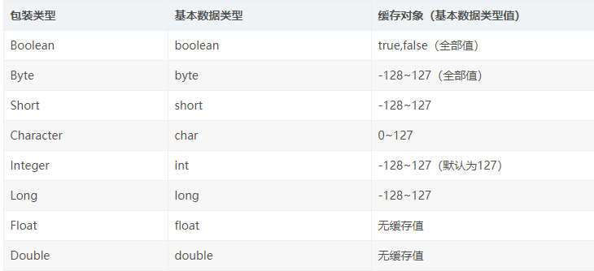

# 基本数据类型

基本类型（内置类型），是 Java 中不同于类（Class）的特殊类型。

Java 基本类型共有八种，基本类型可以分为三类：

- 字符类型（char）

- 布尔类型（boolean）

- 数值类型（byte、short、int、long、float、double）

## 基本数据类型好处

在 Java 中，==对象==是存储在==堆==里的，通过==栈==中的==引用==来使用这些对象。所以，对象是比较消耗资源的。

对于经常用到的类型，如 int 等，如果每次使用这种变量的时候都需要 new 一个 Java 对象的话，就会比较笨重。所以，和 C++ 一样，Java 提供了==基本数据类型==，这种数据的变量不需要使用 new 创建，他们不会在堆上创建，而是==直接在栈内存中存储==，因此会更加高效。

# 包装类型

Java 语言是一个面向对象的语言，但是 Java 中的基本数据类型却是不面向对象的，这在实际使用时存在很多的不便，例如，无法将 int 、double 等类型放入集合类中。因为==集合的容器要求元素是 Object 类型==。为了解决这个不足，在设计类时为每个基本数据类型设计了一个对应的类进行代表，这样八个和基本数据类型对应的类统称为==包装类==（Wrapper Class）。

| 基本数据类型 | 包装类    |
| ------------ | --------- |
| byte         | Byte      |
| boolean      | Boolean   |
| short        | Short     |
| char         | Character |
| int          | Integer   |
| long         | Long      |
| float        | Float     |
| double       | Double    |

包装类型让基本类型具有了对象的特征，并且为其添加了属性和方法，丰富了基本类型的操作。

## 装箱与拆箱

在 Java SE5 中，为了减少开发人员的工作，Java 提供了自动拆箱与自动装箱功能。

- 自动装箱：就是将基本数据类型自动转换成对应的包装类（基本数据类型$\rightarrow$包装类）。

- 自动拆箱：就是将包装类自动转换成对应的基本数据类型（包装类$\rightarrow$基本数据类型）。

```java
/**
 * 自动装箱、拆箱
 */
public class AutoBoxOrUnBox {
    public static void main(String[] args) {
        // 等价于 Integer i = new Integer(6);
        Integer i = 6;
        int j = i;
}
```

反编译后代码：

```java
public class AutoBoxOrUnBox {
    public static void main(String[] args) {
        Integer i = Integer.valueOf(10);
        int j = i.intValue();
    }
}
```

**自动==装箱==是通过包装类的`valueOf()`方法来实现的；**

**自动==拆箱==是通过包装类对象的`xxxValue()`来实现的（如booleanValue()、longValue()等）。**

## 自动装箱、拆箱示例

### 将基本数据类型放入集合类

```java
import java.util.ArrayList;
 
/**
 * 自动装箱、拆箱
 */
public class AutoBoxOrUnBox {
    public static void main(String[] args) {
        Integer one = 1;
        Integer two = 2;
        ArrayList<Integer> arrayList = new ArrayList<>();
        arrayList.add(one); arrayList.add(two);
        for (Integer integer : arrayList) {
            System.out.println(integer);
        }
    }
}
```

反编译后代码：

```java
import java.util.ArrayList;
 
public class AutoBoxOrUnBox {
    public static void main(String[] args) {
        Integer one = Integer.valueOf(1);
        Integer two = Integer.valueOf(2);
        ArrayList<Integer> arrayList = new ArrayList<>();
        arrayList.add(one); arrayList.add(two);
        for (Integer integer : arrayList)
        	System.out.println(integer); 
    }
}
```

### 包装类型和基本类型的比较

```java
Integer a = 1;
System.out.println(a == 1 ? "等于" : "不等于");
Boolean bool = false;
System.out.println(bool ? "真" : "假");
```

反编译后代码：

```java
Integer a = 1;
System.out.println(a.intValue() == 1 ? "等于" : "不等于");
Boolean bool = false;
System.out.println(bool.booleanValue ? "真" : "假");
```

### 包装类型的运算

```java
import java.util.ArrayList;
 
/**
 * 自动装箱、拆箱
 */
public class AutoBoxOrUnBox {
    public static void main(String[] args) {
        Integer i = 1;
        Integer j = 2;
        int res = i + j;
        System.out.println(res);
    }
}
```

反编译后代码：

```java
package autoBox;
 
public class AutoBoxOrUnBox {
    public static void main(String[] args) {
        Integer i = Integer.valueOf(1);
        Integer j = Integer.valueOf(2);
        int res = i.intValue() + j.intValue();
        System.out.println(res);
    }
}
```

### 三目运算符的使用

```java
package autoBox;
 
public class AutoBoxOrUnBox {
    public static void main(String[] args) {
        boolean flag = true;
        Integer i = 0;
        int j = 1;
        int k = flag ? i : j;
        System.out.println(k);
    }
}
```

反编译后代码：

```java
package autoBox;
 
public class AutoBoxOrUnBox {
    public static void main(String[] args) {
        boolean flag = true;
        Integer i = Integer.valueOf(0);
        int j = 1;
        int k = flag ? i.intValue() : j;
        System.out.println(k);
    }
}
```

当第二，第三位操作数分别为==基本类型==和==对象==时，其中的<font color=red>对象就会拆箱为基本类型进行操作</font>（基本类型 : 对象 $\longrightarrow$ 基本类型 : 基本类型）。

例子中，第二位的 i 是一个包装类型的对象，而第三位的 j 是一个基本类型，所以会对包装类进行自动拆箱。<font color=red>如果这个时候 i 的值为 null，那么就会发生 NPE（自动拆箱导致空指针异常）。</font>

当第二位和第三位表达式都是包装类型的时候，该表达式的结果才是该包装类型；否则，<font color=red>只要有一个表达式的类型是基本数据类型，则表达式得到的结果都是基本数据类型</font>。如果结果不符合预期，那么编译器就会进行自动拆箱。

### 函数参与返回值

```java
// 自动拆箱
public int getNum(Integer num) {
    // num.intValue()
    return num;
}

// 自动装箱
public Integer getNum(int num) {
    // Integer.valueOf(num)
    return num;
}
```

### 包装类缓存

```java
public class AutoBoxOrUnBox {
    public static void main(String[] args) {
        Integer integer1 = 6;
        Integer integer2 = 6;

        if (integer1 == integer2) {
            System.out.println("integer1 == integer2"); // 正确
        }

        if (integer1 != integer2) {
            System.out.println("integer1 != integer2");
        }

        Integer integer3 = 200;
        Integer integer4 = 200;

        if (integer3 == integer4) {
            System.out.println("integer1 == integer2");
        }

        if (integer3 != integer4) {
            System.out.println("integer1 != integer2"); // 正确
        }
    }
}
```

<font color=red>integer1 和 integer2 对象的地址肯定是不一样的</font>，但是为什么会是这个结果呢？

在Java 5中，在 Integer 的操作上，引入了一个新功能来节省内存和提高性能。<font color=red>整型对象通过使用相同的对象引用实现了缓存和重用</font>。



# 自动拆装箱带来的空指针问题

例如，在使用三目运算符的过程中，可能会进行自动拆箱而导致==NPE==问题。

```java
boolean flag = true;
// 定义一个【基本数据类型】的boolean变量
boolean simpleBoolean = false;

// 定义一个【包装类对象】类型的Boolean变量，值为null
Boolean nullBoolean = null;

// 使用三目运算符，并给x变量赋值
boolean x = flag ? nullBoolean : simpleBoolean; 
```

以上代码，在运行过程中，会抛出NPE：

```markdown
Exception in thread "main" java.lang.NullPointerException
```

以上代码反编译后：

```java
boolean flag = true;
boolean simpleBoolean = false;
Boolean nullBoolean = null;

// nullBoolean.booleanValue() 自动拆箱，转化为基本数据类型
boolean x = flag ? nullBoolean.booleanValue() : simpleBoolean;
```

反编译后的代码的最后一行，编译器帮我们做了一次自动拆箱，而就是因为这次自动拆箱，导致代码出现对于一个null对象（`nullBoolean.booleanValue()`）的调用，导致了NPE。

# 参考资料

[Java自动装箱与自动拆箱以及拆箱空指针问题](https://blog.csdn.net/sunshunli/article/details/111088467)

