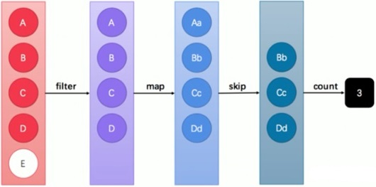

# 介绍

Stream（流）是一个==来自数据源（流的来源，可以是集合，数组等）==的==元素队列==，元素是特定类型的对象，形成一个队列。 Java 中的 Stream 并==不存储元素==，而是按需计算。

和以前的 Collection 操作不同， Stream 操作有两个基础的特征：

- ==Pipelining==：中间操作都会返回流对象本身。 这样多个操作可以串联成一个管道， 如同流式风格（fluentstyle）。 这样做可以对操作进行优化， 比如延迟执行（laziness）和短路（short-circuiting）。

- ==内部迭代==：以前对集合遍历都是通过 Iterator 或者增强 for 的方式，==显式的在集合外部进行迭代==， 这叫做外部迭代。 Stream 提供了内部迭代的方式，==流可以直接调用遍历方法==。



上图中展示了过滤、映射、跳过、计数等多步操作，这是一种集合元素的处理方案，而方案就是一种“函数模型”。

图中的每一个方框都是一个“流”，调用指定的方法，可以从一个流模型转换为另一个流模型。最右侧的数字3是最终结果。<font color=red>这里的 filter、map、skip 都是在==对函数模型进行操作==，集合元素并没有真正被处理。只有当终结方法 count 执行的时候，整个模型才会按照指定策略执行操作。而这得益于Lambda 的延迟执行特性</font>。

> **备注**：“Stream流”其实是一个集合元素的==函数模型==，它并==不是集合==，也==不是数据结构==，其本身并==不存储任何元素（或其地址值）==。

**当使用一个流的时候，通常包括三个基本步骤：**

获取一个数据源（source）$\longrightarrow$ 数据转换 $\longrightarrow$ 执行操作获取想要的结果。每次转换原有 Stream 对象不改变，返回一个新的 Stream 对象（可以有多次转换），这就允许对其操作可以像链条一样排列，变成一个管道。


# 获取流

## 根据 Collection 获取流

java.util.Collection 接口中加入了 default 方法 stream 用来获取流，所以其所有实现类均可获取流：

```java
List<String> list = new ArrayList<>();
Stream<String> stream1 = list.stream();

Set<String> set = new HashSet<>();
Stream<String> stream2 = set.stream();
```

## 根据 Map 获取流

<font color=red>java.util.Map 接口不是 Collection 的子接口，且其 K-V 数据结构不符合流元素的单一特征</font>，所以获取对应的流需要分 key、value 或 entry 等情况：

```java
Stream<String> keyStream = map.keySet().stream();
Stream<String> valueStream = map.values().stream();
Stream<Map.Entry<String, String>> entryStream = map.entrySet().stream();
```

## 根据数组获取流

如果使用的不是集合或映射而是数组，由于==数组对象不可能添加默认方法==，所以 Stream 接口中提供了静态方法 `of`：

```java
String[] array = { "张无忌", "张翠山", "张三丰", "张一元" };
Stream<String> stream = Stream.of(array);
```

# Stream 中常用方法

引入依赖：

```xml
<dependencies>
    <!-- 日志 -->
    <dependency>
        <groupId>ch.qos.logback</groupId>
        <artifactId>logback-classic</artifactId>
        <version>1.2.3</version>
    </dependency>

    <!-- @Test -->
    <dependency>
        <groupId>org.junit.jupiter</groupId>
        <artifactId>junit-jupiter-api</artifactId>
        <version>5.7.0</version>
    </dependency>
</dependencies>
```


## forEach：逐一处理

```java
import org.junit.jupiter.api.Test;
import org.slf4j.Logger;
import org.slf4j.LoggerFactory;

import java.util.stream.Stream;

/**
 * @author chenzufeng
 * @date 2021/11/8
 * @usage StreamTest
 */
public class StreamTest {
    private static final Logger logger = LoggerFactory.getLogger(StreamTest.class);

    @Test
    public void forEachDemo() {
        String[] array = {"张无忌", "张翠山", "张三丰", "张一元"};
        Stream<String> stringStream = Stream.of(array);
        // stringStream.forEach(logger::info)
        stringStream.forEach(str -> logger.info(str));
    }
}
```

## filter：过滤

```java
public class StreamTest {
    private static final Logger logger = LoggerFactory.getLogger(StreamTest.class);
    /**
     * filter：过滤
     */
    @Test
    public void filterDemo() {
        String[] array = {"张无忌", "张三丰", "周芷若"};
        Stream<String> stringStream = Stream.of(array);
        // 过滤
        Stream<String> filterResult = stringStream.filter(str -> str.startsWith("张"));
        filterResult.forEach(logger::info);
    }
}
```

## map：映射

如果需要将流中的元素映射到另一个流中（将当前流中的 T 类型数据转换为另一种 R 类型的流），可以使用 map 方法。

```java
public class StreamTest {
    private static final Logger logger = LoggerFactory.getLogger(StreamTest.class);

    /**
     *  map：映射
     */
    @Test
    public void mapDemo() {
        String[] array = {"10", "12", "18"};
        Stream<String> stringStream = Stream.of(array);
        Stream<Integer> integerStream = stringStream.map(result -> Integer.parseInt(result));
        integerStream.forEach(integer -> logger.info(String.valueOf(integer)));
    }
}
```

## count：统计流中的元素个数

```java
public class StreamTest {
    private static final Logger logger = LoggerFactory.getLogger(StreamTest.class);
    
    /**
     *  count：统计流中的元素个数，得到的值为long型
     */
    @Test
    public void countDemo() {
        String[] array = {"张无忌", "张三丰", "周芷若"};
        Stream<String> stringStream = Stream.of(array);
        long count = stringStream.count();
        logger.info(String.valueOf(count));
    }
}
```

## limit：取用前几个

limit 方法可以对流进行截取，只取用前 $n$ 个：

```java
public class StreamTest {
    private static final Logger logger = LoggerFactory.getLogger(StreamTest.class);

    /**
     *  limit：取用前几个
     */
    @Test
    public void limitDemo() {
        String[] array = {"张无忌", "张三丰", "周芷若"};
        Stream<String> stringStream = Stream.of(array);
        // 只取数组中前2个
        Stream<String> limitStream = stringStream.limit(2);
        limitStream.forEach(logger::info);
    }
}
```

## skip：跳过前几个

如果流的当前长度大于$n$（`skip(long n)`），则跳过前$n$个；否则将会得到一个长度为$0$的空流。

```java
public class StreamTest {
    private static final Logger logger = LoggerFactory.getLogger(StreamTest.class);

    /**
     *  skip：跳过前几个
     */
    @Test
    public void skipDemo() {
        String[] array = {"张无忌", "张三丰", "周芷若"};
        Stream<String> stringStream = Stream.of(array);
        Stream<String> newStream = stringStream.skip(2);
        newStream.forEach(logger::info);
    }
}
```

## concat：组合

如果有两个流，希望合并成为一个流，那么可以使用 Stream 接口的==静态方法== `concat`：

```java
public class StreamTest {
    private static final Logger logger = LoggerFactory.getLogger(StreamTest.class);

    /**
     *  concat：组合
     */
    @Test
    public void concatDemo() {
        Stream<String> stream1 = Stream.of("张三");
        Stream<String> stream2 = Stream.of("李四");
        Stream<String> newStream = Stream.concat(stream1, stream2);
        newStream.forEach(logger::info);
    }
}
```

## sorted：排序

```java
public class StreamTest {
    private static final Logger logger = LoggerFactory.getLogger(StreamTest.class);

    /**
     *  sorted：排序
     *  输出：a b c
     */
    @Test
    public void sortDemo() {
        String[] array = {"c", "b", "a", "a"};
        Stream<String> stringStream = Stream.of(array);
        stringStream.limit(3).sorted().forEach(logger::info);
    }
}
```

## 分组

```java
public static <T, K, A, D> Collector<T, ?, Map<K, D>> groupingBy(
    Function<? super T, ? extends K> classifier, Collector<? super T, A, D> downstream
)
```


```java
public class StreamTest {
    private static final Logger logger = LoggerFactory.getLogger(StreamTest.class);

    /**
     * 分组
     */
    @Test
    public void groupingByDemo() {
        List<String> items = Arrays.asList("apple", "apple", "banana", "apple", "orange", "banana", "papaya");
        Map<String, Long> result = items.stream()
                .collect(Collectors.groupingBy(Function.identity(), Collectors.counting()));
        result.entrySet().stream().forEach(System.out::println);
    }
}
```

## 查找

检测是否全部都满足指定的参数行为，如果全部满足则返回true：

```java
allMatch(Predicate<? super T> predicate)
```

检测是否存在一个或多个满足指定的参数行为，如果满足则返回true：

```java
anyMatch(Predicate<? super T> predicate)
```

检测是否不存在满足指定行为的元素，如果不存在则返回true：

```java
noneMatch(Predicate<? super T> predicate)
```

返回满足条件的第一个元素：

```java
findFirst()
```

findAny 相对于 findFirst 的区别在于，findAny 不一定返回第一个，而是返回任意一个：

```java
findAny()
```


```java
public class StreamTest {
    private static final Logger logger = LoggerFactory.getLogger(StreamTest.class);
    /**
     * 查找
     */
    @Test
    public void findDemo() {
        List<String> items = Arrays.asList("apple", "apple", "banana", "apple", "orange", "banana", "papaya");
        Stream<String> stringStream = items.stream();
        // true
        logger.info(String.valueOf(stringStream.allMatch(str -> str.contains("a"))));
        /*
         * 不能直接在stringStream上继续进行处理
         * logger.info(stringStream.filter(str -> str.contains("a")).findFirst().get())
         * 会报错：
         * java.lang.IllegalStateException: stream has already been operated upon or closed
         */
        Stream<String> stringStream1 = items.stream();
        // apple
        logger.info(stringStream1.filter(str -> str.contains("a")).findFirst().get());
    }
}
```

## 字符串拼接

```java
public class StreamTest {
    private static final Logger logger = LoggerFactory.getLogger(StreamTest.class);

    @Test
    public void joinDemo() {
        List<String> list = new ArrayList<>();
        list.add("张无忌");
        list.add("周芷若");
        list.add("赵敏");
        // [张无忌, 周芷若, 赵敏]
        logger.info(String.valueOf(list));
        // 张无忌,周芷若,赵敏
        logger.info(list.stream().collect(Collectors.joining(",")));
    }
}
```

## 归约

```java
public class StreamTest {
    private static final Logger logger = LoggerFactory.getLogger(StreamTest.class);

    @Test
    public void reduceDemo() {
        List<Integer> num = Arrays.asList(1, 2, 4, 5, 6, 7);
        // 求和 25
        num.stream().reduce((x, y) -> x + y).ifPresent(System.out::println);
        // 求最大值 7
        num.stream().reduce(Integer::max).ifPresent(System.out::println);
    }
}
```


# 参考资料

[1] [Stream流处理介绍以及Stream的基本操作](https://zhuanlan.zhihu.com/p/265884828)

[2] [Java 8系列之Stream的基本语法详解](https://www.cnblogs.com/mrhgw/p/9171883.html)

https://stackabuse.com/guide-to-java-streams-foreach-with-examples/

