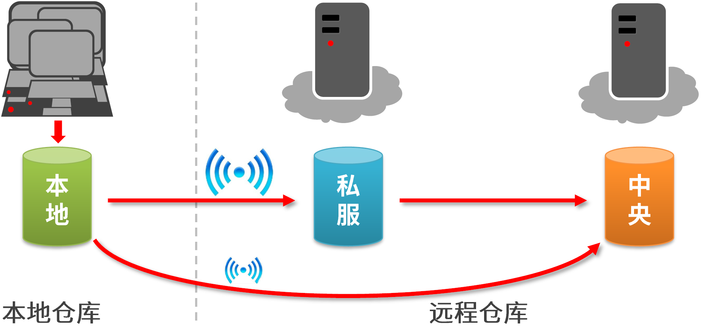
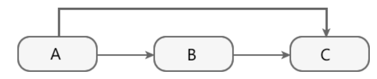
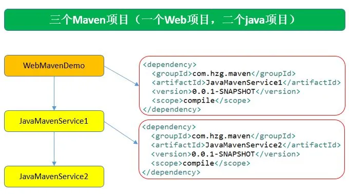
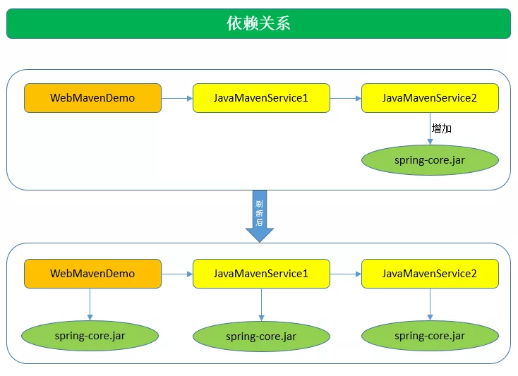
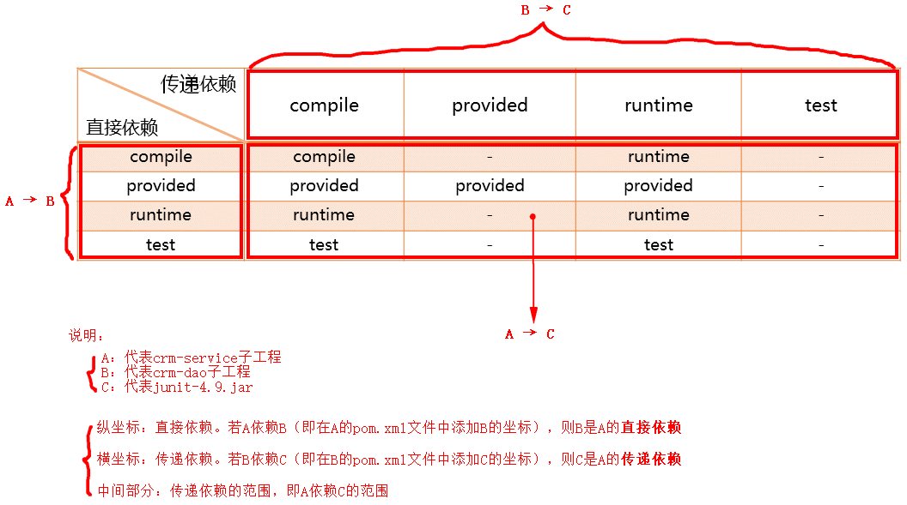
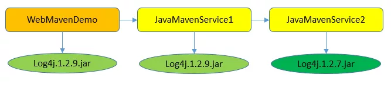
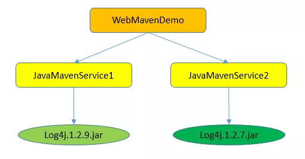

# 仓库和坐标

## 仓库

用于存储资源，包含各种jar包。

## 仓库作用

本地仓库：

- 本地电脑上存储资源的仓库，可连接远程仓库获取资源

远程仓库：非本机上的仓库，为本地仓库提供资源

- 中央仓库：由Maven团队维护的全球唯一的仓库，存储所有资源的仓库（开源）
- 私服：部门、公司范围内存储资源的仓库，从中央仓库获取资源
  - 保存具有版权的资源；一定范围内共享资源，不对外共享。
  - 解决访问速度慢：私服存在jar包后，直接在私服获取，不必再去中央仓库获取




## 坐标

maven坐标和仓库对应的映射关系：

\[groupId]\[artifactId]\[version][artifactId]-[version].jar

去本地仓库看一下此目录：

org\springframework\spring-core\4.3.4.RELEASE\spring-core-4.3.4.RELEASE.jar

### POM文件

POM是Project Object Model（项目对象模型）的缩写。`pom.xml`文件中包含了依赖关系、构建目录、源目录、测试源目录、插件、目标等项目信息和配置信息。Maven读取`pom.xml`文件，然后执行构建目标。

一个pom.xml文件至少需要包含以下元素：

| **元素**         | **描述**                                                     |
| ---------------- | ------------------------------------------------------------ |
| **project**      | pom文件根元素，表示一个项目                                  |
| **modelVersion** | project元素的子元素，指定modelVersion版本号，应该设置为4.0.0 |
| **groupId**      | project元素的子元素，指定项目所属的group                     |
| **artifactId**   | project元素的子元素，项目交付件（项目的最终交付文件，如jar、zip、war等）ID |
| **version**      | project元素的子元素，项目（交付件）的版本号                  |
| **packaging**    | 定义打包类型，如jar, war                                     |
| **name**         | 指定项目名称                                                 |
| **url**          | 指定项目url                                                  |
| **dependencies** | 表示项目依赖项列表                                           |
| **dependency**   | 表示单个依赖项，这个元素是依赖项列表元素的子元素             |
| **scope**        | 单个依赖项的作用域，作用域可以是compile、test、runtime、provided、system之一，作用域的意图是限定该依赖项作用范围，如test，则表明依赖项只在test时起作用 |

### 坐标定义与作用

Maven中的坐标用于描述仓库中资源的位置。

使用唯一坐标，唯一定位资源的位置，通过该标识可以将资源的识别与下载工作交由Maven完成。

### 坐标的组成

```xml
<groupId>com.example</groupId>
<artifactId>SpringBootMyBatis</artifactId>
<version>0.0.1-SNAPSHOT</version>
```

groupId：定义当前Maven项目隶属组织名称，通常是域名反写；

artifactId：定义当前Maven项目名称（通常是模块名称）；

version：定义当前项目版本号；

packaging：定义该项目的打包方式。


# 依赖管理

## 依赖配置

依赖指当前项目运行所需的jar包，一个项目可以设置多个依赖：

```xml
<dependencies>
    <!-- SpringBoot框架Web项目起步依赖 -->
    <dependency>
        <groupId>org.springframework.boot</groupId>
        <artifactId>spring-boot-starter-web</artifactId>
        <scope>xxxxxx</scope>
    </dependency>
</dependencies>
```

## 依赖传递

依赖具有传递性：

- 直接依赖：在当前项目中，通过依赖配置，建立的依赖关系
- 间接依赖：被依赖的资源，如果依赖其他资源，当前项目间接依赖其他资源

项目 A 依赖于项目 B，B 又依赖于项目 C，此时 B 是 A 的直接依赖，C 是 A 的间接依赖：



Maven 的依赖传递机制是指：<font color=red>不管 Maven 项目存在多少间接依赖，POM 中都只需要定义其直接依赖，不必定义任何间接依赖</font>，Maven 会动读取当前项目各个直接依赖的 POM，将那些必要的间接依赖以传递性依赖的形式引入到当前项目中。Maven 的依赖传递机制能够帮助用户一定程度上简化 POM 的配置。


基于 A、B、C 三者的依赖关系，根据 Maven 的依赖传递机制，我们只需要在项目 A 的 POM 中定义其直接依赖 B，在项目 B 的 POM 中定义其直接依赖 C，Maven 会解析 A 的直接依赖 B的 POM ，将间接依赖 C 以传递性依赖的形式引入到项目 A 中。

通过这种依赖传递关系，可以使依赖关系树迅速增长到一个很大的量级，很有可能会出现==依赖重复==。



WebMavenDemo项目依赖JavaMavenService1；JavaMavenService1项目依赖JavaMavenService2。

<font color=red>pom.xml文件配置好依赖关系后，必须首先mvn install后，依赖的jar包才能使用</font>：

- WebMavenDemo的pom.xml文件想能编译通过，JavaMavenService1必须mvn install
- <font color=red>JavaMavenService1的pom.xml文件想能编译通过，JavaMavenService2必须mvn install</font>



<font color=red>为JavaMavenService2中增加了一个spring-core.jar包后，会惊喜的发现依赖的两个项目都自动的增加了这个jar包</font>，这就是依赖的传递性。

> 注意：非compile范围的依赖是不能传递的。

## 依赖范围

Maven 在对项目进行编译、测试和运行时，会分别使用三套不同的 classpath。Maven 项目构建时，在不同阶段引入到 classpath 中的依赖时不同的：

- 编译时，Maven 会将与编译相关的依赖引入到==编译 classpath== 中；
- 测试时，Maven 会将与测试相关的的依赖引入到==测试 classpath== 中；
- 运行时，Maven 会将与运行相关的依赖引入到==运行 classpath== 中。

我们可以在 POM 的依赖声明使用 ==scope 元素==来控制依赖与三种 classpath（编译 classpath、测试 classpath、运行 classpath ）之间的关系，这就是==依赖范围==。

Maven 具有以下 6 中常见的依赖范围：

| 依赖范围 | 描述                                                         |
| -------- | ------------------------------------------------------------ |
| compile  | 编译依赖范围，scope 元素的==缺省值==。使用此依赖范围的 Maven 依赖，对于==三种 classpath 均有效==，即该 Maven 依赖在上述三种 classpath 均会被引入。例如，log4j 在编译、测试、运行过程都是必须的。 |
| test     | 测试依赖范围。使用此依赖范围的 Maven 依赖，只对==测试 classpath== 有效。例如，Junit 依赖只有在测试阶段才需要。 |
| provided | 已提供依赖范围。使用此依赖范围的 Maven 依赖，只对==编译 classpath 和测试 classpath 有效==。例如，servlet-api 依赖对于编译、测试阶段而言是需要的，但是运行阶段，由于外部容器已经提供，故不需要 Maven 重复引入该依赖。 |
| runtime  | 运行时依赖范围。使用此依赖范围的 Maven 依赖，只对测试 classpath、运行 classpath 有效。例如，JDBC 驱动实现依赖，<font color=red>其在编译时只需 JDK 提供的 JDBC 接口即可，只有测试、运行阶段才需要实现了 JDBC 接口的驱动</font>。 |
| system   | 系统依赖范围，其效果与 provided 的依赖范围一致。其用于添加非 Maven 仓库的本地依赖，通过依赖元素 dependency 中的 systemPath 元素指定本地依赖的路径。鉴于使用其会导致项目的可移植性降低，一般不推荐使用。 |
| import   | 导入依赖范围，该依赖范围只能与 dependencyManagement 元素配合使用，其功能是将目标 pom.xml 文件中 dependencyManagement 的配置导入合并到当前 pom.xml 的 dependencyManagement 中。 |

依赖范围与三种 classpath 的关系一览表：

| 依赖范围 | 编译 classpath | 测试 classpath | 运行 classpath | 例子                    |
| -------- | -------------- | -------------- | -------------- | ----------------------- |
| compile  | √              | √              | √              | log4j                   |
| test     | -              | √              | -              | junit                   |
| provided | √              | √              | -              | servlet-api             |
| runtime  | -              | √              | √              | JDBC-driver             |
| system   | √              | √              | -              | 非 Maven 仓库的本地依赖 |

## 依赖范围对传递依赖的影响

项目 A 依赖于项目 B，B 又依赖于项目 C，此时我们可以将 A 对于 B 的依赖称之为第一直接依赖，B 对于 C 的依赖称之为第二直接依赖。

B 是 A 的直接依赖，C 是 A 的间接依赖，根据 Maven 的依赖传递机制，<font color=red>间接依赖 C 会以传递性依赖的形式引入到 A 中，但这种引入并不是无条件的，它会受到依赖范围的影响</font>。

传递性依赖的依赖范围受第一直接依赖和第二直接依赖的范围影响，如下表所示：

|          | compile  | test | provided | runtime  |
| -------- | -------- | ---- | -------- | -------- |
| compile  | compile  | -    | -        | runtime  |
| test     | test     | -    | -        | test     |
| provided | provided | -    | provided | provided |
| runtime  | runtime  | -    | -        | runtime  |



## 依赖调节

Maven 的依赖传递机制可以简化依赖的声明，用户只需要关心项目的直接依赖，而不必关心这些直接依赖会引入哪些间接依赖。

但当一个间接依赖存在多条引入路径时，为了避免出现依赖重复的问题，Maven 通过依赖调节来确定间接依赖的引入路径。

依赖调节遵循以下两条原则：

1. 引入路径短者优先
2. 先声明者优先


以上两条原则，<font color=red>优先使用第一条原则解决</font>，第一条原则无法解决，再使用第二条原则解决。

### 引入路径短者优先

引入路径短者优先，顾名思义，<font color=red>当一个间接依赖存在多条引入路径时，引入路径短的会被解析使用</font>。

例如，A 存在这样的依赖关系：

A $\rightarrow$ B $\rightarrow$ C $\rightarrow$ E(1.0)

A $\rightarrow$ D $\rightarrow$ E(2.0)

E 是 A 的间接依赖，但两条引入路径上有两个不同的版本，很显然不能同时引入，否则造成重复依赖的问题。

根据 Maven 依赖调节的第一个原则：引入路径短者优先。

E(1.0) 的路径长度为 3，E(2.0) 的路径长度为 2，因此间接依赖 E(2.0) 将从A $\rightarrow$ D $\rightarrow$ E(2.0) 路径引入到 A 中。



Service2的log4j的版本是1.2.7版本，Service1排除了此包的依赖，自己加了一个Log4j的1.2.9的版本，那么<font color=red>WebMavenDemo项目遵守路径最短优先原则，Log4j的版本和Sercive1的版本一致</font>。

### 先声明者优先

先声明者优先，顾名思义，<font color=red>在引入路径长度相同的前提下，POM 文件中依赖声明的顺序，决定了间接依赖会不会被解析使用，顺序靠前的优先使用</font>。

例如，A 存在以下依赖关系：

A $\rightarrow$ B $\rightarrow$ D(1.0)

A $\rightarrow$ C $\rightarrow$ D(2.0)

D 是 A 的间接依赖，其两条引入路径的长度都是 2，此时 Maven 依赖调节的第一原则已经无法解决，需要使用第二原则：先声明者优先。

A 的 POM 文件中配置如下：

```xml
<dependencies>
    ...      
    <dependency>
        ...
        <artifactId>B</artifactId>       
        ...
    </dependency>
    
    <dependency>
        ...
        <artifactId>C</artifactId>
        ...
    </dependency>
</dependencies>
```

由于 B 的依赖声明比 C 靠前，所以间接依赖 D(1.0) 将从 A $\rightarrow$ B $\rightarrow$ D(1.0) 路径引入到 A 中。



WebMavenDemo项目依赖Sercive1和Service2，它俩是同一个路径，那么<font color=red>谁在WebMavenDemo的pom.xml中先声明的依赖就用谁的版本</font>。

## Maven排除依赖和可选依赖

Maven 依赖具有传递性，例如 A 依赖于 B，B 依赖于 C，在不考虑依赖范围等因素的情况下，Maven 会根据依赖传递机制，将间接依赖 C 引入到 A 中。

但如果 A 出于某种原因，希望==将间接依赖 C 排除==，那该怎么办呢？

Maven 为用户提供了两种解决方式：排除依赖（Dependency Exclusions）和可选依赖（Optional Dependencies）。

排除依赖和可选依赖都能在项目中将间接依赖排除在外，但两者实现机制却完全不一样。

- **排除依赖**是控制==当前项目==，==是否使用==其直接依赖==传递下来==的接间依赖；**可选依赖**是控制当前项目的依赖==是否向下传递==（<font color=red>对外隐藏当前所依赖的资源</font>）；

- **可选依赖**的优先级==高于==**排除依赖**；
- 若对于同一个间接依赖，同时使用排除依赖和可选依赖进行设置，那么可选依赖的取值必须为 false，否则排除依赖无法生效。

- 

### 排除依赖

假设存在这样的依赖关系，A 依赖于 B，B 依赖于 X，B 又依赖于 Y。B 实现了两个特性，其中一个特性依赖于 X，另一个特性依赖于 Y，且==两个特性是互斥的关系==，用户无法同时使用两个特性，所以 ==A 需要排除 X==，此时就可以在 A 中将间接依赖 X 排除（实际是，<font color=red>在 A 的 POM 文件，关于依赖 B 的依赖声明中，排除X</font>）。

排除依赖是通过在 A 中使用 ==exclusions 元素==实现的，该元素下可以包含若干个 exclusion 子元素，用于排除若干个间接依赖，示例代码如下：

```xml
<project xmlns="http://maven.apache.org/POM/4.0.0" xmlns:xsi="http://www.w3.org/2001/XMLSchema-instance"
         xsi:schemaLocation="http://maven.apache.org/POM/4.0.0 http://maven.apache.org/xsd/maven-4.0.0.xsd">
    <modelVersion>4.0.0</modelVersion>
    
    <groupId>net.biancheng.www</groupId>
    <artifactId>A</artifactId>
    <version>1.0-SNAPSHOT</version>
    
    <dependencies>
        <dependency>
            <groupId>net.biancheng.www</groupId>
            <artifactId>B</artifactId>
            <version>1.0-SNAPSHOT</version>
            <exclusions>
                <!-- 设置排除 -->
                <!-- 排除依赖必须基于直接依赖中的间接依赖设置为可以依赖为 false -->
                <!-- 设置当前依赖中是否使用间接依赖 -->
                <exclusion>
                    <!--设置具体排除-->
                    <groupId>net.biancheng.www</groupId>
                    <artifactId>X</artifactId>
                </exclusion>
            </exclusions>
        </dependency>
    </dependencies>
</project>
```

关于 exclusions 元素及排除依赖说明如下：

- 排除依赖是控制当前项目，是否使用其==直接依赖传递下来==的间接依赖；
- exclusions 元素下可以包含若干个 exclusion 子元素，用于排除若干个间接依赖；
- exclusion 元素用来设置具体排除的间接依赖，该元素包含两个子元素：groupId 和 artifactId，用来确定需要排除的间接依赖的坐标信息；
- exclusion 元素中只需要设置 groupId 和 artifactId 就可以确定需要排除的依赖，无需指定版本 version。


### 可选依赖

与上文的应用场景相同，也是 A 希望排除间接依赖 X，<font color=red>除了在 A 的 POM 文件，关于依赖 B 的依赖声明中，将 X 设置为排除依赖外，还可以在 B 的 POM 文件中，将引入的依赖 X 设置为可选依赖</font>。

在 <font color=red>B 的 POM 关于 X 的依赖声明中</font>使用 ==optional 元素==，将其设置成可选依赖，示例配置如下：

```xml
<project xmlns="http://maven.apache.org/POM/4.0.0"
         xmlns:xsi="http://www.w3.org/2001/XMLSchema-instance"
         xsi:schemaLocation="http://maven.apache.org/POM/4.0.0 http://maven.apache.org/maven-v4_0_0.xsd">
    <modelVersion>4.0.0</modelVersion>
    
    <groupId>net.biancheng.www</groupId>
    <artifactId>B</artifactId>
    <packaging>jar</packaging>
    <version>1.0-SNAPSHOT</version>
    
    <dependencies>
        <dependency>
            <groupId>net.biancheng.www</groupId>
            <artifactId>X</artifactId>
            <version>1.0-SNAPSHOT</version>
            <!--设置可选依赖  -->
            <optional>true</optional>
        </dependency>
    </dependencies>
</project>
```

关于 optional 元素及可选依赖说明如下：

- 可选依赖用来控制，当前依赖是否==向下传递==成为间接依赖（<font color=red>对外隐藏当前所依赖的资源</font>）；
- optional ==默认值为 false==，表示可以向下传递称为间接依赖；
- 若 optional 元素取值为 ==true==，则表示当前依赖==不能==向下传递成为间接依赖。


# 生命周期与插件

Maven有三套相互独立的生命周期，请注意这里说的是“三套”，而且“相互独立”。

这三套生命周期分别是：

- **default** – 编译源代码并处理打包项目相关的所有事情
- **clean** – 清理构建输出，包括生成的编译类、JAR文件等
- **site** – 为项目生成文档

每一个构建生命周期都是独立执行的，可以让Maven同时执行多个构建生命周期，它们之间彼此独立，就像独立执行Maven命令一样。

## Clean Lifecycle

**Clean Lifecycle 在进行真正的构建之前进行一些清理工作。** Clean生命周期一共包含了三个阶段：

- pre-clean 执行一些需要在clean之前完成的工作
- clean 移除所有上一次构建生成的文件
- post-clean 执行一些需要在clean之后立刻完成的工作

## Default Lifecycle

**Default Lifecycle 构建的核心部分，编译，测试，打包，部署等等。**

- validate：校验项目是否正确，并且所有必要的信息可以完成项目的构建过程
- initialize：初始化构建状态，比如设置属性值
- generate-sources
- process-sources
- generate-resources
- process-resources：复制并处理资源文件，至目标目录，准备打包
- <font color=red>compile</font>：编译项目的源代码
- process-classes
- generate-test-sources
- process-test-sources
- generate-test-resources
- process-test-resources：复制并处理资源文件，至目标测试目录
- test-compile：编译测试源代码
- process-test-classes
- test：使用合适的单元测试框架运行测试。这些测试代码不会被打包或部署
- prepare-package
- <font color=red>package</font>：接受编译好的代码，打包成可发布的格式，如 JAR
- pre-integration-test
- integration-test
- post-integration-test
- verify
- <font color=red>install</font>：将包安装至==本地仓库==，以让其它项目依赖。
- <font color=red>deploy</font>：将最终的包复制到==远程的仓库==，以让其它开发人员与项目共享

**总结：** <font color=red>不论你要执行生命周期的哪一个阶段，maven都是从这个生命周期的开始执行</font>。执行mvn install，其中已经执行了compile 和 test 。

**插件：** 每个阶段都有插件（plugin：`maven-install-plugin:2.4:install`），插件的职责就是执行它对应的命令。

## Site Lifecycle

**Site Lifecycle 生成项目报告，站点，发布站点。**

- pre-site：执行一些需要在生成站点文档之前完成的工作
- site：生成项目的站点文档
- post-site：执行一些需要在生成站点文档之后完成的工作，并且为部署做准备
- site-deploy：将生成的站点文档部署到特定的服务器上


## 插件

Maven实际上是一个`插件执行框架`，`Maven中的所有任务都是由插件完成的`。

Maven插件是构建目标的集合，也称为MOJO (Maven Old Java Object)。`可以把插件理解为一个类，而构建目标是类中的方法`。构建阶段包含一系列的构建目标，可以理解为`按顺序调用各个插件中的构建目标`（方法），然后一系列的构建阶段组成一个构建生命周期。

构建目标可以绑定到多个构建阶段，也可以不绑定，就像类的方法可以被调用，也可以不被调用。

```xml
<build>
    <finalName>hellospringboot</finalName>

      <plugins>
          <!-- SpringBoot项目编译打包插件 -->
          <plugin>
              <groupId>org.springframework.boot</groupId>
              <artifactId>spring-boot-maven-plugin</artifactId>
          </plugin>
          
          <!--Mybatis代码自动生成插件-->
            <plugin>
                <groupId>org.mybatis.generator</groupId>
                <artifactId>mybatis-generator-maven-plugin</artifactId>
                <version>1.3.7</version>
                <configuration>
                    <!--配置文件的位置-->
                    <configurationFile>GeneratorMapper.xml</configurationFile>
                    <verbose>true</verbose>
                    <overwrite>true</overwrite>
                </configuration>
            </plugin>
      </plugins>

    <pluginManagement><!-- lock down plugins versions to avoid using Maven defaults (may be moved to parent pom) -->
      <plugins>
        <plugin>
          <artifactId>maven-clean-plugin</artifactId>
          <version>3.1.0</version>
        </plugin>
        <!-- see http://maven.apache.org/ref/current/maven-core/default-bindings.html#Plugin_bindings_for_war_packaging -->
        <plugin>
          <artifactId>maven-resources-plugin</artifactId>
          <version>3.0.2</version>
        </plugin>
        <plugin>
          <artifactId>maven-compiler-plugin</artifactId>
          <version>3.8.0</version>
        </plugin>
        <plugin>
          <artifactId>maven-surefire-plugin</artifactId>
          <version>2.22.1</version>
        </plugin>
        <plugin>
          <artifactId>maven-war-plugin</artifactId>
          <version>3.2.2</version>
        </plugin>
        <plugin>
          <artifactId>maven-install-plugin</artifactId>
          <version>2.5.2</version>
        </plugin>
        <plugin>
          <artifactId>maven-deploy-plugin</artifactId>
          <version>2.8.2</version>
        </plugin>
      </plugins>
    </pluginManagement>
</build>
```


# 参考资料

[1] [Maven依赖传递,排除依赖和可选依赖](https://www.cnblogs.com/cy0628/p/15034450.html)

