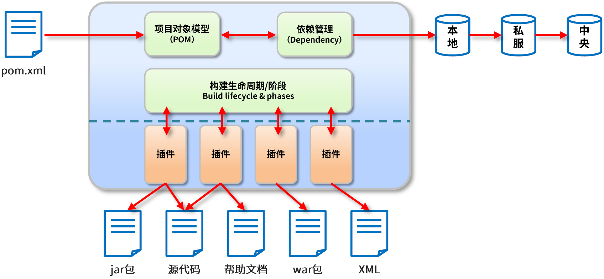
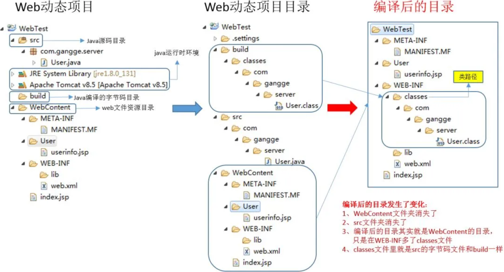
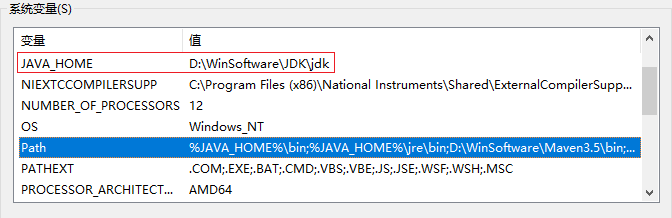
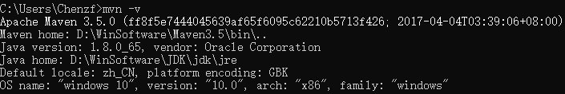
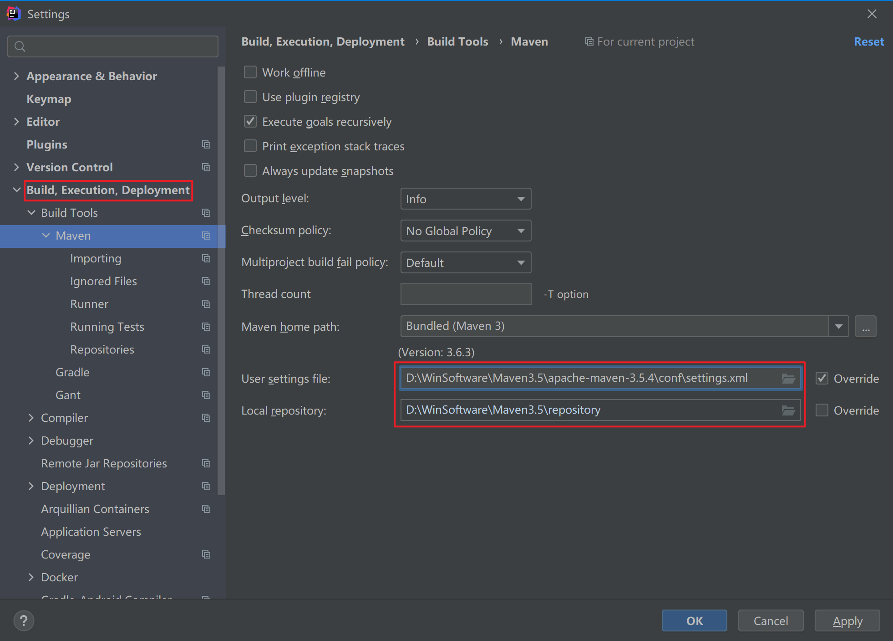

# 为什么使用Maven

## Java项目需要的东西

Java项目需要的东西：

- 确定项目的==目录结构==
  - `src`目录存放Java源码，`resources`目录存放配置文件，`bin`目录存放编译生成的`.class`文件。

- 需要确定引入哪些依赖包——==依赖包的管理==
  - 需要引用各种jar包，尤其是比较大的工程，引用的jar包往往有几十个乃至上百个， 每用到一种jar包，都需要手动引入工程目录，而且经常遇到各种让人抓狂的`jar包冲突`、`版本冲突`。
- ==配置环境==
  - JDK的版本，编译打包的流程，当前代码的版本号。
- 通过命令行工具进行编译，让项目在一个独立的服务器上==编译、测试、部署==

项目从编译、测试、运行、打包、安装 ，部署整个过程都交给Maven进行管理，这个过程称为<font color=red>构建</font>。整个构建过程，使用Maven一个命令可以轻松完成整个工作。

## Maven解决对应的问题

Maven的作用：

- 统一开发项目结构；

- 依赖管理：管理项目依赖的资源，避免资源间的版本冲突问题；

- 项目构建。


**① 一个项目就是一个工程**

如果==项目非常庞大==，就不适合使用package来<font color=red>划分模块</font>，最好是==每一个模块对应一个工程==，利于分工协作。

借助于maven就可以<font color=red>将一个项目拆分成多个工程</font>。

**② 项目中使用jar包，需要“复制”、“粘贴”项目的lib中**

同样的jar包重复的出现在不同的项目工程中，你需要做不停的复制粘贴的重复工作。借助于maven，可以<font color=red>将jar包保存在“仓库”中，不管在哪个项目只要使用==引用==即可就行</font>。

**③ jar包需要的时候每次都要自己准备好或到官网下载**

借助于maven我们可以使用<font color=red>统一的规范方式下载jar包</font>。

**④ jar包版本不一致的风险**

不同的项目在使用jar包的时候，有可能会导致各个项目的jar包版本不一致，导致未执行错误。

借助于maven，所有的jar包都放在“仓库”中，所有的项目都使用仓库的一份jar包，<font color=red>避免ar包版本不一致问题</font>。

**⑤ 一个jar包依赖其他的jar包需要自己手动的加入到项目中**

FileUpload组件 $\Rightarrow$ IO组件，即`commons-fileupload-1.3.jar`依赖于`commons-io-2.0.1.jar`

极大的浪费了我们导入包的时间成本，也极大的增加了学习成本。借助于maven，它会<font color=red>自动的将依赖的jar包导入进来</font>。


# 什么是Maven

Maven本质是一个项目管理工具，将项目开发和管理过程，抽象成一个项目对象模型（POM）：



使用Maven插件，可以完成==项目构建==操作。一个构建过程，包含若干个插件；一个插件，可以完成若干个生命周期的构建。而Jar包、源代码、帮助文档等就是插件构建的结果。


**① maven是一款服务于Java平台的自动化构建工具**

make $\Rightarrow$ Ant $\Rightarrow$ Maven $\Rightarrow$ Gradle

**② 构建**

构建定义：把动态的Web工程经过编译得到的==编译结果==，==部署到服务器上==的整个过程。

编译：Java源文件[`.java`] $\Rightarrow$ 编译 $\Rightarrow$ Classz字节码文件[`.class`]

部署：最终在sevlet容器中部署的不是动态web工程，而是编译后的文件。



**③ 构建的各个环节**

- ==清理clean==：将以前编译得到的旧文件class字节码文件删除；
- ==编译compile==：将java源程序编译成class字节码文件；
- 测试test：自动测试，自动调用junit程序；
- 报告report：测试程序执行的结果；
- ==打包package==：动态Web工程打War包，Java工程打jar包；打包到本项目，一般是在项目==target目录==下，存放的就是编译后的==字节码文件==。
- ==安装install==：Maven特定的概念 $\rightarrow$ 将打包得到的文件部署到==本地仓库==中的指定位置；
- ==部署deploy==：把打好的可执行jar包（war包或其它形式的包）布署到==本地maven仓库==和==远程maven私服仓库==。

# 安装Maven

## 下载并安装

要安装Maven，可以从[Maven官网](https://archive.apache.org/dist/maven/maven-3/3.5.4/binaries/)下载最新的Maven，然后在本地解压。`安装Maven的前提是完成Java环境安装`，**Maven依赖于Java环境**。Maven运行时依赖Java，系统中需要安装jdk(并设置JAVA_HOME环境变量)，不能使用jre，maven需要用到Java编译器，jre不包含。

Maven为绿色软件解压后即可使用。解压后需要`设置环境变量`：



打开命令行窗口，输入`mvn -version`，应该看到Maven的版本信息：



## settings.xml 设置

Maven解压后目录下会有一个`settings.xml`文件，位置`\Maven3.5\conf\settings.xml`，用来<font color=red>配置Maven的仓库和本地Jar包存储地址</font>（Maven启动后，会自动保存下载的资源到本地仓库）。

Maven仓库地址代表从哪里去下载项目中的依赖包Jar包；**Maven会将所有的Jar包统一存储到一个地址下，方便各个项目复用**。默认本地仓库位置在`C:\Users\Chenzf\.m2\repository`。

`localRepository`设置`本地存放Jar包地址`，可以根据自己的情况改动：

```xml
<!-- localRepository
 | The path to the local repository maven will use to store artifacts.
 |
 | Default: ${user.home}/.m2/repository
<localRepository>/path/to/local/repo</localRepository>
-->
  <localRepository>D:\WinSoftware\Maven\repository</localRepository>
```

<span id="mirrors">`mirrors`</span><font color=red>为仓库列表配置的下载镜像列表</font>：

```xml
<mirrors>
  <!-- mirror
   | Specifies a repository mirror site to use instead of a given repository. The repository that
   | this mirror serves has an ID that matches the mirrorOf element of this mirror. IDs are used
   | for inheritance and direct lookup purposes, and must be unique across the set of mirrors.
   |
  <mirror>
    <id>mirrorId</id>
    <mirrorOf>repositoryId</mirrorOf>
    <name>Human Readable Name for this Mirror.</name>
    <url>http://my.repository.com/repo/path</url>
  </mirror>
   -->
    <mirror>
        <id>alimaven</id>
        <!-- 对哪个仓库进行镜像（替代哪个仓库） -->
        <mirrorOf>central</mirrorOf>
        <name>aliyun maven</name>
        <url>http://maven.aliyun.com/nexus/content/repositories/central/</url>
    </mirror>
</mirrors>
```

## IDEA设置Maven

为所有项目进行设置：




# 参考资料

[1] [Maven 最全教程](https://mp.weixin.qq.com/s/uT-te5Cx5fv0TfZih-ARsw)