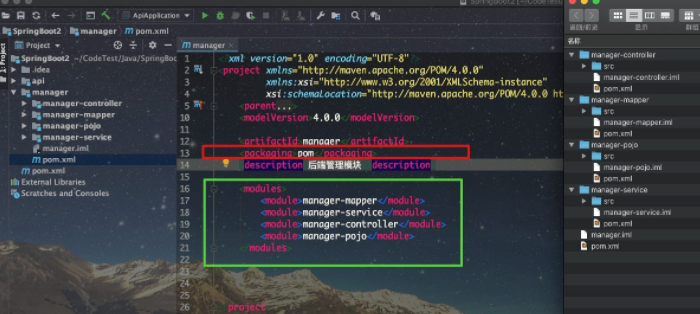
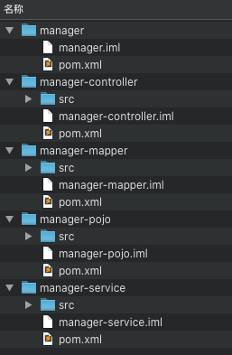

# 聚合与继承

## 聚合

对于复杂的Maven项目，一般建议采用多模块的方式来设计开发，便于后期维护管理。但是构建项目时，如果每次都需要按模块一个一个进行构建会十分麻烦，而Maven的聚合功能就可以很好的解决这个问题，当用户对聚合模块执行构建任务时，会对所有被其聚合的模块自动地依次进行构建任务。

这里通过一个实例进行介绍，在manager模块中有 manager-mapper、manager-service、manager-controller、manager-pojo 四个模块，为了避免依次构建这四个模块，我们这里<font color=red>添加了一个新的模块manager用于将这四个模块聚合在一起，通常我们称manager为==聚合模块==</font>。

从下图实例我们可以看出，聚合模块不包含任何源码，其只有一个POM文件。因为该模块的作用只是为了聚合其他模块方便我们一次性构建其下的所有模块，所以其POM文件的内容与一般的POM文件有所差别。

首先，<font color=red>将打包方式packaging元素设置为pom</font>，然后通过modules下的module子元素来添加该聚合模块需要聚合的模块的**目录路径**：



<font color=red>在聚合模块manager下执行构建任务，即可看到其所聚合的四个聚合将会全部执行</font>，大大方便我们构建项目。

实例中，聚合模块和被聚合模块之间的目录结构是==父子目录==结构，实际上其还可以是==平行目录==结构，如下图所示：



如果使用平行目录结构下，聚合模块的POM文件中的被聚合模块的目录路径需要进行修改，因为module元素的值是基于当前POM文件的相对目录：

```xml
<modules>
    <module>../manager-mapper</module>
    <module>../manager-service</module>
    <module>../manager-controller</module>
    <module>../manager-pojo</module>
</modules>
```


# 参考资料

[1] [Maven(四)：聚合与继承](https://zhuanlan.zhihu.com/p/139793065)

