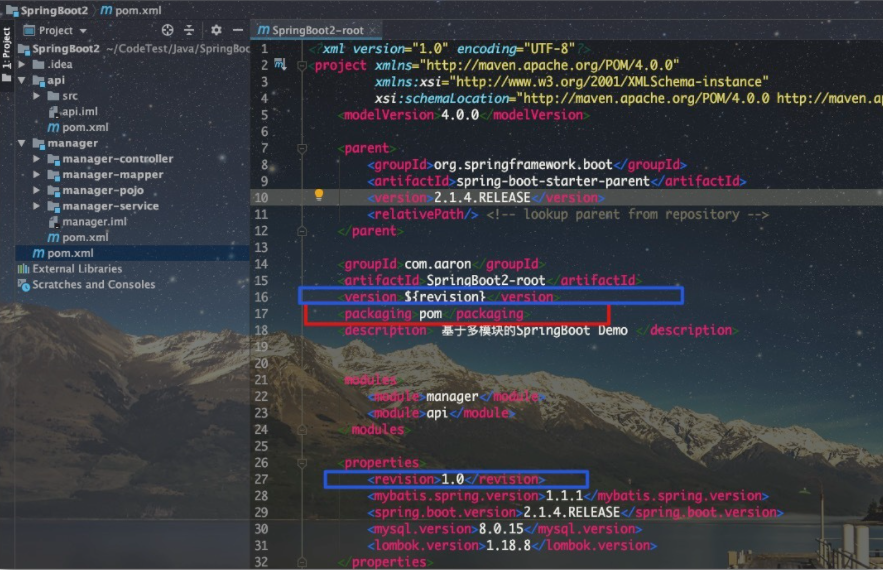
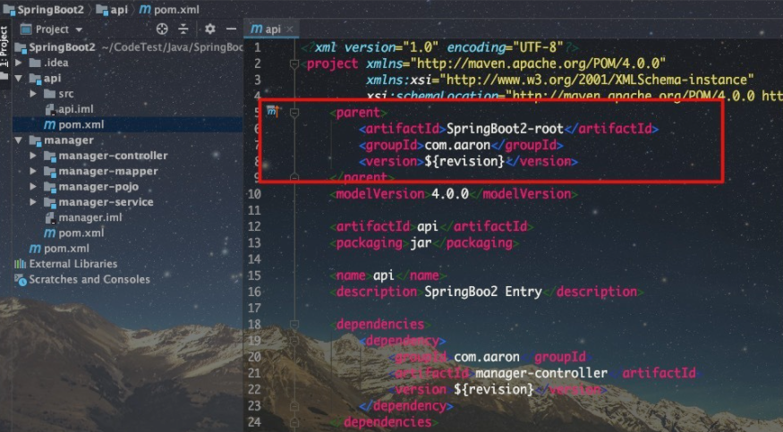
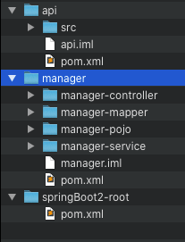
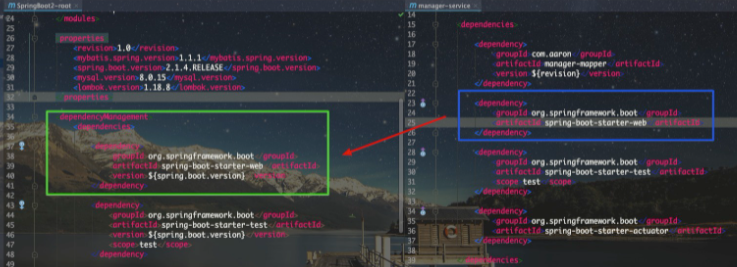

# 聚合与继承

Maven的聚合和继承是两个完全不同的概念。前者是为了快速方便地构建项目中的多个模块；后者则是为了消除POM中的重复配置。

对于聚合模块来说，它知道有哪些模块被聚合，但那些被聚合的模块则不知道这个聚合模块的存在；对于父模块来说，它不知道有哪些子模块继承它，但那些子模块则必须知道其继承是哪个模块。

从形式上来说，聚合模块、父模块也是有一些共同点的，首先，这两种模块POM的打包类型(packaging)均为pom；其次，这种模块中除了POM文件外，均不含项目任何的实际源码。鉴于此，项目开发中，为了方便起见，一个模块是父模块的同时也可是聚合模块。

## 聚合

对于复杂的Maven项目，一般建议采用多模块的方式来设计开发，便于后期维护管理。但是构建项目时，如果每次都需要按模块一个一个进行构建会十分麻烦，而Maven的聚合功能就可以很好的解决这个问题，当用户对聚合模块执行构建任务时，会对所有被其聚合的模块自动地依次进行构建任务。

这里通过一个实例进行介绍，在manager模块中有 manager-mapper、manager-service、manager-controller、manager-pojo 四个模块，为了避免依次构建这四个模块，我们这里<font color=red>添加了一个新的模块manager用于将这四个模块聚合在一起，通常我们称manager为==聚合模块==</font>。

从下图实例我们可以看出，聚合模块不包含任何源码，其只有一个POM文件。因为该模块的作用只是为了聚合其他模块方便我们一次性构建其下的所有模块，所以其POM文件的内容与一般的POM文件有所差别。

首先，<font color=red>将打包方式packaging元素设置为pom</font>，然后通过modules下的module子元素来添加该聚合模块需要聚合的模块的**目录路径**：


<font color=red>在聚合模块manager下执行构建任务，即可看到其所聚合的四个聚合将会全部执行</font>，大大方便我们构建项目。

实例中，聚合模块和被聚合模块之间的目录结构是==父子目录==结构，实际上其还可以是==平行目录==结构，如下图所示：


如果使用平行目录结构下，聚合模块的POM文件中的被聚合模块的目录路径需要进行修改，因为module元素的值是基于当前POM文件的相对目录：

```xml
<modules>
    <module>../manager-mapper</module>
    <module>../manager-service</module>
    <module>../manager-controller</module>
    <module>../manager-pojo</module>
</modules>
```


## 继承

在一个多模块的项目中，<font color=red>如果对于同一个依赖的依赖声明要在多个模块的POM都进行声明，则会导致有大量重复的依赖声明</font>。

所以Maven在设计之时，借鉴了面向对象中的继承思想，<font color=red>可在父模块的POM中声明依赖，子模块的POM文件可通过继承父模块的POM来获得对相关依赖的声明</font>。对于父模块而言，其目的是为了消除子模块的POM文件的重复配置，其不含有任何实际的项目代码，所以<font color=red>父模块POM文件的packaging元素同样需要设置为pom</font>，如下所示：



<font color=red>在子模块的POM文件中，通过parent元素声明对父模块的POM文件的继承</font>。parent元素中的==relativePath子元素==用来指明==父模块POM的路径==，该值默认值为==../pom.xml==。其值同样是一个是<font color=red>基于当前POM文件的相对路径</font>。

所以对于使用==父子目录结构==的实例的api模块而言，该元素值可省略不用显式指定，使用默认值即可：



如果使用==平行目录结构==，则在api模块的POM中的relativePath元素应配置为==../springBoot2-root/pom.xml==。



Maven可通过继承获得POM元素，列表如下：

- groupId：项目组ID，项目坐标的核心元素
- version：项目版本，项目坐标的核心元素
- description：项目的描述信息
- organization：项目的组织信息
- inceptionYear：项目的创始年份
- url：项目的URL地址
- developers：项目的开发者信息
- contributors：项目的贡献者信息
- distributionManagement：项目的部署配置
- issueManagement：项目的缺陷跟踪系统信息
- ciManagement：项目的持续集成系统信息
- scm：项目的版本控制系统信息
- mailingLists：项目的邮件列表信息
- properties：自定义的Maven属性
- dependencies：项目的依赖配置
- dependencyManagement：项目的依赖管理配置
- repositories：项目的仓库配置
- build：包括项目的源码目录配置、输出目录配置、插件配置、插件管理配置等
- reporting：包括项目的报告输出目录配置、报告插件配置等


### dependency Management

子模块可通过继承获得父模块中声明的dependencies元素——**即全部依赖**，这样虽然避免了在各个子模块POM中重复写依赖声明，但是这样也会造成另外一个问题——会<font color=red>导致子模块中引入了不必要的依赖</font>。

为此Maven引入了dependencyManagement来对依赖进行管理。<font color=red>该元素下的依赖声明**不会实际引入到子模块中，只有在子模块的dependencies元素下同样声明了该依赖，才会引入到当前模块中**</font>。

子模块中dependencies声明的依赖若未指定版本号，将使用dependencyManagement中该依赖指定的版本；否则，将覆盖dependencyManagement中该依赖指定的版本。



所以较好的实践是，<font color=red>在父模块POM中通过dependencyManagement元素声明子模块需要使用的依赖及其版本</font>。由于dependencyManagement元素同样可被继承，故我们<font color=red>在各个子模块POM的dependencies元素下声明实际需要用到的依赖</font>。

这样看上去虽然不能减少子模块的POM配置，但是，其一方面可以<font color=red>在父模块的POM中统一管理子模块用到的依赖的版本</font>（更进一步地，dependencyManagement中元素的版本亦支持==引用属性==），另一方面也不至于将不必要的依赖引入到模块中。

### plugin Management 插件管理

对于插件而言，如果在每个子模块中分别声明插件版本及插件配置，会显得十分繁琐。为此Maven针对插件的管理提供了pluginManagement元素，其和dependencyManagement元素基本原理一致。

在pluginManagement元素声明的插件及插件配置不会发生实际效果，只有当继承该POM的子模块声明了相应插件才会被**实际引入**，同时默认使用pluginManagement中该插件的版本及插件配置。

如果某个子模块需要不同的版本及配置，则可在该子模块中显式指定以覆盖父模块POM的pluginManagement配置。

### import 依赖范围

我们在一个新的项目/模块中，如果期望<font color=red>复用其他POM中dependencyManagement元素的配置</font>，可以通过继承或拷贝该配置实现。实际上，还有第三种办法，<font color=red>通过 ==import== 将目标POM的dependencyManagement配置导入、合并到当前POM的dependencyManagement元素中</font>，因为maven只支持单继承，如果当前项目已经继承了一个父模块，此时即可通过import导入的方式来复用其他POM中的dependencyManagement配置。需要注意的是，由于import依赖范围的特殊性，其一般指向的是打包类型为pom的模块。故**其type只能为pom**：

```xml
<dependencyManagement>
    <dependencies>
        ...
        <dependency>
            <groupId>com.tony</groupId>
            <artifactId>json</artifactId>
            <version>1.0</version>
            <type>pom</type>
            <scope>import</scope>
        </dependency>
        ...
    </dependencies>
</dependencyManagement>
```


# 属性

## 自定义属性

等同于定义变量，方便统一维护。

定义格式：

```xml
<properties>
    <spring.version>5.1.9.RELEASE</spring.version>
</properties>
```

调用格式：

```xml
<dependency>
    <groupId>org.springframework</groupId>
    <artifactId>spring-context</artifactId>
    <version>${spring.version}</version>
</dependency>
```


# 版本管理

- SNAPSHOT（快照版本）：输出的临时性版本（测试阶段版本）
- RELEASE（发布版本）：向团队外部发布的较为稳定的版本（5.1.9.RELEASE）
- 版本号：<主版本>.<次版本>.<增量版本>.<里程碑版本>
  - 主版本：表示项目重大架构的变更，如Spring5相较于Spring4的迭代
  - 次版本：表示有较大的功能增加和变化，或者全面系统地修复漏洞
  - 增量版本：表示有重大漏洞地修复
  - 里程碑版本


# 私服


# 参考资料

[1] [Maven(四)：聚合与继承](https://zhuanlan.zhihu.com/p/139793065)

