# 参考文档

[1] [狂神说SpringBoot14：集成Swagger终极版](https://mp.weixin.qq.com/s/0-c0MAgtyOeKx6qzmdUG0w)

<span name="ref2">[2] [Swagger 入门教程](http://www.imooc.com/wiki/swaggerlesson)</span>

<span name="ref3">[3] [swagger2 注解说明 ( @ApiImplicitParams )](https://blog.csdn.net/jiangyu1013/article/details/83107255)</span>

<span name="ref4">[4] [Swagger常用注解](https://www.cnblogs.com/three-fighter/p/12346184.html)</span>

# SpringBoot 集成 Swagger

## 创建工程

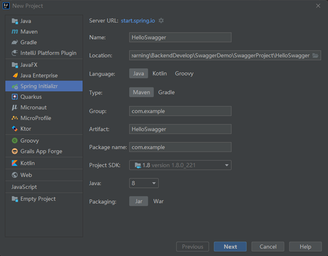

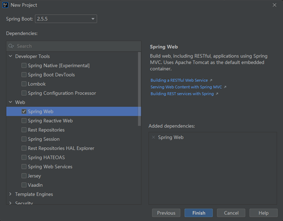

## 引入依赖

```xml
<!-- https://mvnrepository.com/artifact/io.springfox/springfox-swagger2 -->
<dependency>
    <groupId>io.springfox</groupId>
    <artifactId>springfox-swagger2</artifactId>
    <version>2.9.2</version>
</dependency>

<!-- https://mvnrepository.com/artifact/io.springfox/springfox-swagger-ui -->
<dependency>
    <groupId>io.springfox</groupId>
    <artifactId>springfox-swagger-ui</artifactId>
    <version>2.9.2</version>
</dependency>
```

## 创建接口

```java
package com.example.controller;

import org.springframework.web.bind.annotation.GetMapping;
import org.springframework.web.bind.annotation.RestController;

/**
 * @author chenzufeng(00018397)
 * @date 2021/10/12
 */
@RestController
public class SwaggerController {
    @GetMapping("/helloSwagger")
    public String helloSwagger() {
        return "Hello Swagger !";
    }
}
```


## 使用 Swagger

```java
package com.example.config;

import org.springframework.context.annotation.Configuration;
import springfox.documentation.swagger2.annotations.EnableSwagger2;

/**
 * @author chenzufeng(00018397)
 * @date 2021/10/12
 * Swagger配置：@Configuration - 配置类；@EnableSwagger2 - 开启Swagger2的自动配置
 */
@Configuration
@EnableSwagger2
public class SwaggerConfig {

}
```

访问：[http://localhost:8080/swagger-ui.html](http://localhost:8080/swagger-ui.html) ，可以看到 Swagger 的界面：

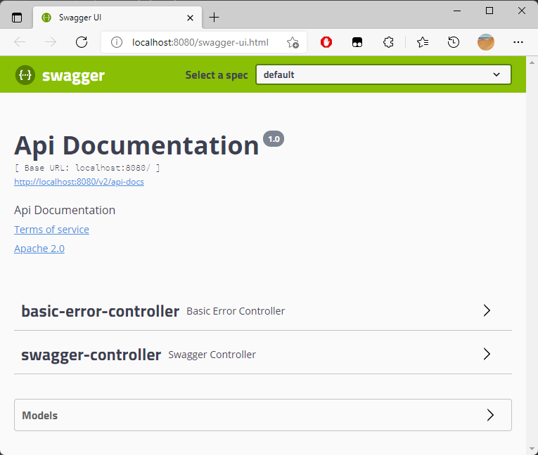


# Swagger 配置

## 配置 Swagger 信息

Swagger 实例 Bean 是 Docket，所以通过配置 Docket 实例来配置 Swaggger。

```java
@Configuration
@EnableSwagger2
public class SwaggerConfig {
    /**
     * 配置 Docket 的 Bean 实例
     * @return Docket
     */
    @Bean
    public Docket createRestApi() {
        return new Docket(DocumentationType.SWAGGER_2)
                .apiInfo(apiInfo());
    }

    /**
     * 配置 Swagger 信息：apiInfo
     * @return apiInfo
     */
    private ApiInfo apiInfo() {
        return new ApiInfoBuilder()
                .title("HelloSwagger 接口文档")
                .description("HelloSwagger 的接口文档。")
                .version("1.0.0.RELEASE")
                .build();
    }
}
```

访问：[http://localhost:8080/swagger-ui.html](http://localhost:8080/swagger-ui.html) ，可以看到 Swagger 的界面：

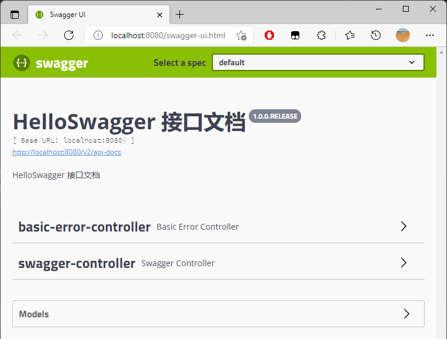

## 配置扫描接口

### RequestHandlerSelectors

```java
@Bean
public Docket createRestApi() {
    return new Docket(DocumentationType.SWAGGER_2)
            .apiInfo(apiInfo())
            // 通过 select()方法，去配置扫描接口
            .select()
            // RequestHandlerSelectors 配置如何扫描接口
            .apis(RequestHandlerSelectors.basePackage("com.example.controller"))
            .build();
}
```

访问：[http://localhost:8080/swagger-ui.html](http://localhost:8080/swagger-ui.html) ，可以看到 Swagger 的界面：

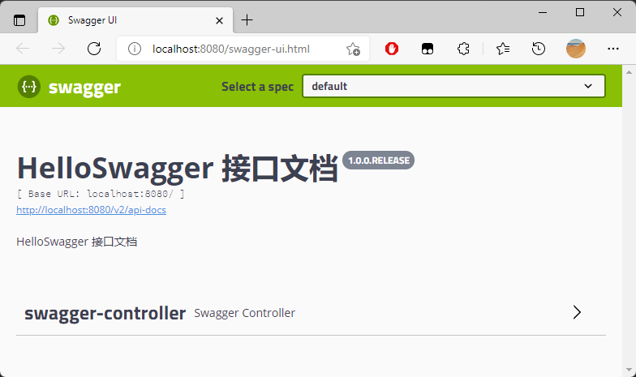

由于配置`根据包的路径扫描接口`，所以只能看到一个类。


除了通过包路径配置扫描接口外，还可以通过`配置其他方式扫描接口`：

```markdown
# 扫描所有，项目中的所有接口都会被扫描到
any() 

# 不扫描接口
none() 

# 通过方法上的注解扫描，如withMethodAnnotation(GetMapping.class)只扫描get请求
withMethodAnnotation(final Class<? extends Annotation> annotation)
```

```markdown
# 通过类上的注解扫描，如withClassAnnotation(Controller.class)只扫描有controller注解的类中的接口
withClassAnnotation(final Class<? extends Annotation> annotation)
```

```markdown
# 根据包路径扫描接口
basePackage(final String basePackage) 
```


### 配置接口扫描过滤

```java
@Bean
public Docket createRestApi() {
    return new Docket(DocumentationType.SWAGGER_2)
            .apiInfo(apiInfo())
            // 通过 select()方法，去配置扫描接口
            .select()
            // RequestHandlerSelectors 配置如何扫描接口
            .apis(RequestHandlerSelectors.basePackage("com.example.controller"))
            // 配置如何通过path过滤，PathSelectors.ant("/example/**")：只扫描请求以/example开头的接口
            .paths(PathSelectors.any())
            .build();
}
```

这里的可选值还有：

```markdown
# 任何请求都扫描
any()

# 任何请求都不扫描
none()

# 通过正则表达式控制
regex(final String pathRegex) 

# 通过ant()控制
ant(final String antPattern)
```


## 配置 Swagger 开关

通过 `enable()` 方法配置是否启用 Swagger，如果是 `false`，Swagger 将不能在浏览器中访问。

```java
@Bean
public Docket createRestApi() {
    return new Docket(DocumentationType.SWAGGER_2)
            .apiInfo(apiInfo())
            // 只能在.select()前添加；配置是否启用Swagger，如果是false，在浏览器将无法访问
            .enable(false)
            .select()
            .apis(RequestHandlerSelectors.basePackage("com.example.controller"))
            .paths(PathSelectors.any())
            .build();
}
```


如何动态配置当项目处于 dev 环境时显示 Swagger，处于 uat 环境时不显示：

```java
@Bean
public Docket createRestApi(Environment environment) {

    // 设置要显示的Swagger环境：是否返回dev，spring.profiles.active=dev（org.springframework.core.env）
    // Profiles of = Profiles.of("dev", "test"); 表示：如何动态配置当项目处于 test、dev 环境时显示 Swagger，处于 prod 时不显示
    Profiles profiles = Profiles.of("dev");
    
    // 获取项目的环境 boolean acceptsProfiles(Profiles profiles);
    boolean environmentFlag = environment.acceptsProfiles(profiles);

    return new Docket(DocumentationType.SWAGGER_2)
            .apiInfo(apiInfo())
            .groupName("HelloSwagger")
            // 只能在.select()前添加；配置是否启用Swagger，如果是false，在浏览器将无法访问
            .enable(environmentFlag)

            .select()
            .apis(RequestHandlerSelectors.basePackage("com.example.controller"))
            .paths(PathSelectors.any())
            .build();
}
```

配置文件：

```properties
# application.properties
spring.profiles.active=dev

# application-dev.properties
server.port=8081

# application-uat.properties
server.port=8082
```

结果：

```markdown
Tomcat initialized with port(s): 8081 (http)
```

访问：[http://localhost:8081/swagger-ui.html](http://localhost:8080/swagger-ui.html) ，可以看到 Swagger 的界面。

## 配置 API 分组

如果没有配置分组，默认是default。通过`groupName()`方法即可配置分组：

```java
@Bean
public Docket createRestApi() {
    return new Docket(DocumentationType.SWAGGER_2)
            .apiInfo(apiInfo())
            // 设置 Select a spec
            .groupName("HelloSwagger")
            .select()
            .apis(RequestHandlerSelectors.basePackage("com.example.controller"))
            .paths(PathSelectors.any())
            .build();
}
```

如何配置多个分组？

配置多个分组只需要配置多个docket即可：

```java
@Bean
public Docket docket1(){
   return new Docket(DocumentationType.SWAGGER_2).groupName("group1");
}
@Bean
public Docket docket2(){
   return new Docket(DocumentationType.SWAGGER_2).groupName("group2");
}
@Bean
public Docket docket3(){
   return new Docket(DocumentationType.SWAGGER_2).groupName("group3");
}
```


## 实体配置

### 新建实体类

```java
package com.example.dto;

import io.swagger.annotations.ApiModel;
import io.swagger.annotations.ApiModelProperty;

/**
 * @author chenzufeng
 * @date 2021/10/12
 * @usage User
 */
@ApiModel("用户实体类User")
public class User {
    @ApiModelProperty("用户名")
    private String userName;
    @ApiModelProperty("密码")
    private String password;

    public String getUserName() {
        return userName;
    }

    public void setUserName(String userName) {
        this.userName = userName;
    }

    public String getPassword() {
        return password;
    }

    public void setPassword(String password) {
        this.password = password;
    }

    @Override
    public String toString() {
        return "User{" +
                "userName='" + userName + '\'' +
                ", password='" + password + '\'' +
                '}';
    }
}
```

### 添加接口

```java
package com.example.controller;

import com.example.dto.User;
import org.springframework.web.bind.annotation.GetMapping;
import org.springframework.web.bind.annotation.PostMapping;
import org.springframework.web.bind.annotation.RestController;

/**
 * @author chenzufeng
 * @date 2021/10/12
 * @usage 接口
 */
@RestController
public class SwaggerController {
    @GetMapping("/helloSwagger")
    public String helloSwagger() {
        return "Hello Swagger !";
    }

    /**
     * 只要这个实体在请求接口的返回值中（即使是泛型），都能映射到实体项
     * @return User
     */
    @PostMapping("/getUser")
    public User getUser() {
        return new User();
    }
}
```

### 测试

访问：[http://localhost:8081/swagger-ui.html](http://localhost:8080/swagger-ui.html) ，可以看到 Swagger 的界面：

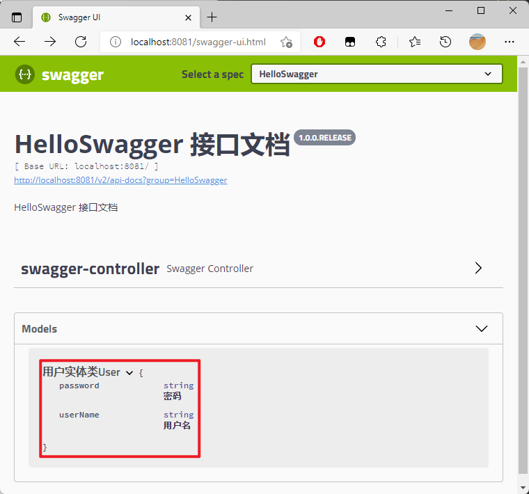

## 美化 Swagger

添加依赖：

```xml
<!-- https://mvnrepository.com/artifact/com.github.xiaoymin/knife4j-spring-boot-starter -->
<dependency>
    <groupId>com.github.xiaoymin</groupId>
    <artifactId>knife4j-spring-boot-starter</artifactId>
    <version>2.0.9</version>
</dependency>
```

访问：[http://localhost:8081/doc.html#/home](http://localhost:8081/doc.html#/home) ，可以看到 Swagger 的界面。

# 常用注解

Swagger 的所有注解<sup><a href="#ref2">[2]</a></sup>定义在`io.swagger.annotations`包下：

| **Swagger注解**                                         | **简单说明**                                                 |
| ------------------------------------------------------- | ------------------------------------------------------------ |
| @Api(tags = "xxx模块说明")                              | 作用在类上，说明该类的作用。可以标记一个 ==Controller 类==作为 Swagger 文档资源 |
| @ApiOperation("xxx接口说明")                            | 作用在接口方法上                                             |
| @ApiModel("xxxPOJO说明")                                | 作用在模型类上：如VO、BO                                     |
| @ApiModelProperty(value = "xxx属性说明", hidden = true) | 作用在类方法和属性上，hidden设置为true可以隐藏该属性         |
| @ApiParam("xxx参数说明")                                | 作用在参数、方法和字段上，类似@ApiModelProperty              |

## @Api

@Api 注解用于标注一个==Controller==（Class）。在默认情况下，Swagger-Core只会扫描解析具有@Api注解的类，而会自动忽略其他类别资源（JAX-RS endpoints，Servlets等等）的注解。

### 参数

| 属性名称 | 属性类型 | 默认值 | 作用               |
| :------- | :------- | :----- | :----------------- |
| tags()   | String[] | 空     | 定义接口类所属分组 |

该属性对实现相同业务功能的接口类做一个大型的==分组==，该分组中包括同业务功能下的所有的接口。

> **Tips ：** 在实际项目开发工作中，往往一个业务可能包括多个接口类的实现，这种情况需要我们对接口类进行多个分组，而 tags 属性的类型是字符串类型的数组，可以描述一个或多个值，如存在多值时，应该使用这种方式来描述：`@Api(tags = {“user”, “customer”})`。

### 使用效果

```java
package com.example.controller;

@Api(tags = "HelloSwagger接口")
@RestController
public class SwaggerController {
}
```

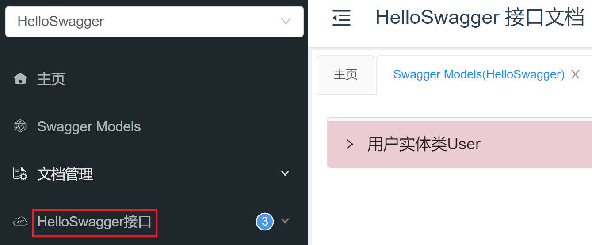

## @ApiOperation

为了方便知道开发的接口功能作，需要给接口添加一些具体的描述信息。为此，在 Swagger 中，使用 `@ApiOperation` 注解来描述写的接口。

### 参数

| 属性名称            | 属性类型 | 默认值     | 作用                         |
| :------------------ | :------- | :--------- | :--------------------------- |
| value()             | String   | 空         | 描述接口的作用是什么         |
| tags()              | String[] | 空         | 定义接口分组                 |
| notes()             | String   | 空         | 对接口方法做进一步详细的描述 |
| httpMethod()        | String   | 空         | 接口请求方式                 |
| nickname()          | String   | 空         | 接口别名                     |
| protocols()         | String   | 空         | 网络请求协议：HTTP、HTTPS    |
| hidden()            | boolean  | false      | 接口是否隐藏                 |
| code()              | int      | 200        | 接口状态码                   |
| response()          | Class<?> | Void.class | 接口返回类型                 |
| responseContainer() | String   | 空         | 接口返回数据类型             |
| responseReference() | String   | 空         | 接口返回引用类型             |
| produces()          | String   | 空         | 接口请求头类型 - 输出        |
| consumes()          | String   | 空         | 接口请求头类型 - 输入        |

### 使用效果

```java
package com.example.controller;

@Api(tags = "HelloSwagger接口")
@RestController
public class SwaggerController {
    @ApiOperation(value = "打印Hello Swagger !", notes = "return \"Hello Swagger !\"")
    @GetMapping("/helloSwagger")
    public String helloSwagger() {
        return "Hello Swagger !";
    }
}
```


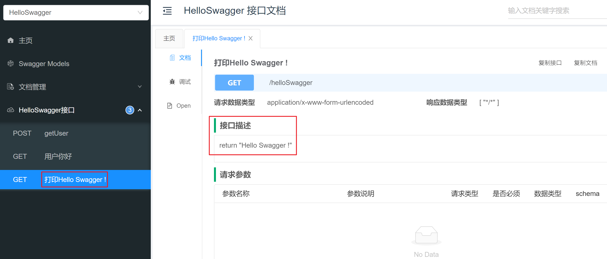

## @ApiParam

ApiParam 注解，是可以作用在==接口方法==上面，以及==接口方法中的参数位置==的注解，其主要是用来给接口中的参数定义相关参数说明，帮助相关人员理解接口中每个参数的含义。

ApiParam 注解同样也提供了丰富的属性，来对接口中的参数添加描述信息，包括该参数的具体含义、参数是否必须传递等。

### 参数

| 属性名称        | 属性类型 | 默认值 | 作用                                                         |
| :-------------- | :------- | :----- | :----------------------------------------------------------- |
| name()          | String   | 空     | 定义==参数名称==：如果**没有使用 name 属性**来描述参数的名称，则参数名称默认为接口中自带的参数名称。（==可以不填==） |
| value()         | String   | 空     | 定义==参数说明==                                             |
| defaultValue    | String   | 空     | 定义参数默认值                                               |
| allowableValues | String   | 空     | 定义参数取值范围                                             |
| required        | boolean  | false  | 定义参数传递必要性                                           |
| access()        | String   | 空     | 定义参数访问规则                                             |
| allowMultiple() | boolean  | false  | 定义参数能否接收多个数值                                     |
| example()       | String   | 空     | 定义参数单个示例                                             |
| hidden()        | boolean  | false  | 定义参数显隐                                                 |

### 使用效果

```java
package com.example.controller;

@Api(tags = "HelloSwagger接口")
@RestController
public class SwaggerController {
    @ApiOperation(value = "Hello {userName}")
    @GetMapping("/hello")
    public String hello(
            @ApiParam(value = "用户名", required = true)
            @RequestParam String userName) {
        return "Hello " + userName;
    }
}
```


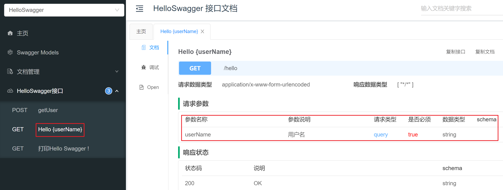

## @ApiImplicitParam

`@ApiImplicitParam` 注解是作用在==接口方法==上的注解，用来对该接口中的参数进行简短的描述。

@ApiImplicitParam 注解提供了丰富的属性，来允许我们自定义接口方法中参数的描述信息，包括接口中参数是否必传、参数类型等。

### 参数

| 属性名称       | 属性类型 | 默认值 | 作用                   |
| :------------- | :------- | :----- | :--------------------- |
| name()         | String   | 空     | 接口中参数名称         |
| value()        | String   | 空     | 接口中参数说明         |
| defaultValue() | String   | 空     | 定义接口中参数的默认值 |
| required()     | boolean  | false  | 定义接口中参数是否必传 |
| paramType()    | String   | 空     | 定义接口中参数使用位置 |
| dataType()     | boolean  | 空     | 定义接口中参数类型     |

ApiImplicitParams 和 ApiImplicitParam<sup><a href="#ref3">[3]</a></sup>

```markdown
@ApiImplicitParams：用在请求的方法上，表示一组参数说明
    @ApiImplicitParam：用在@ApiImplicitParams注解中，指定一个请求参数的各个方面
        name：参数名
        value：参数的汉字说明、解释
        required：参数是否必须传
        paramType：参数放在哪个地方
            · header --> 请求参数的获取：@RequestHeader
            · query --> 请求参数的获取：@RequestParam
            · path（用于restful接口）--> 请求参数的获取：@PathVariable
            · body（不常用）
            · form（不常用）    
        dataType：参数类型，默认String，其它值dataType="Integer"       
```


### 使用效果

```java
@ApiImplicitParams({
    @ApiImplicitParam(name = "mobile", value = "手机号", required = true, paramType = "form"),
    @ApiImplicitParam(name = "password", value = "密码", required = true, paramType = "form"),
    @ApiImplicitParam(name = "age", value = "年龄", required = true, paramType = "form", dataType = "Integer")
	})
@PostMapping("/login")
public JsonResult login(
    @RequestParam String mobile, 
    @RequestParam String password,
    @RequestParam Integer age) {
    //...
    return JsonResult.ok(map);
}
```


## @ApiModel 和 @ApiModelProperty

@ApiModel 注解是作用在接口相关==实体类==上的注解，用来对该接口相关实体类添加额外的描述信息，常常和 @ApiModelProperty 注解配合使用。

@ApiModelProperty 注解是作用在接口相关==实体类的参数==上的注解，用来对具体的接口相关实体类中的参数添加额外的描述信息，常常和 @ApiModel 注解关联使用，有时也会单独拿出来用。

### 参数

ApiModel 注解：

| 属性名称      | 属性类型 | 默认值 | 作用                   |
| :------------ | :------- | :----- | :--------------------- |
| value()       | String   | 空     | 自定义类的名称         |
| description() | String   | 空     | 为类添加长文本描述信息 |

ApiModelProperty 注解：

| 属性名称          | 属性类型 | 默认值 | 作用                 |
| :---------------- | :------- | :----- | :------------------- |
| value()           | String   | 空     | 定义参数描述信息     |
| name()            | String   | 空     | 定义参数名称         |
| required()        | boolean  | false  | 定义参数是否必传     |
| hidden()          | boolean  | false  | 定义参数是否隐藏     |
| allowEmptyValue() | boolean  | false  | 定义参数是否允许为空 |

### 使用效果

实体类：

```java
package com.example.dto;

@ApiModel(value = "实体类：User")
public class User {
    @ApiModelProperty(value = "用户名", required = true)
    private String userName;
    @ApiModelProperty(value = "密码", required = true)
    private String password;

    // Getter & Setter
}
```

接口：

```java
package com.example.controller;

@Api(tags = "HelloSwagger接口")
@RestController
public class SwaggerController {

    /**
     * 只要这个实体在请求接口的返回值中（即使是泛型），都能映射到实体项
     * @return User
     */
    @PostMapping("/getUser")
    public User getUser(@RequestBody User user) {
        return user;
    }
}
```

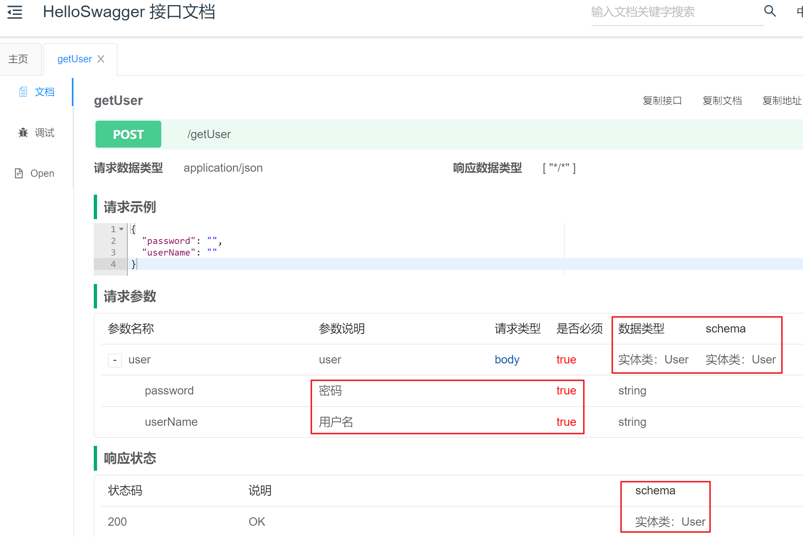

设置接口注解：

```java
package com.example.controller;

@Api(tags = "HelloSwagger接口")
@RestController
public class SwaggerController {
    /**
     * 只要这个实体在请求接口的返回值中（即使是泛型），都能映射到实体项
     * @return User
     */
    @ApiOperation(value = "提交用户信息")
    @PostMapping("/getUser")
    public User getUser(
            @ApiParam(value = "用户实体类User", required = true)
            @RequestBody User user) {
        return user;
    }
}
```

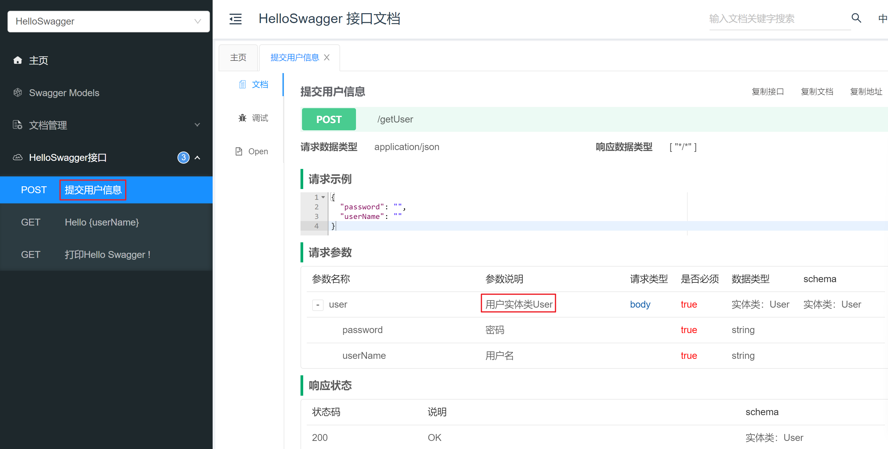

# 完整demo

## 依赖

```java
<dependencies>
        <dependency>
            <groupId>org.springframework.boot</groupId>
            <artifactId>spring-boot-starter-web</artifactId>
        </dependency>

        <dependency>
            <groupId>org.springframework.boot</groupId>
            <artifactId>spring-boot-starter-test</artifactId>
            <scope>test</scope>
        </dependency>

        <!-- https://mvnrepository.com/artifact/io.springfox/springfox-swagger2 -->
        <dependency>
            <groupId>io.springfox</groupId>
            <artifactId>springfox-swagger2</artifactId>
            <version>2.9.2</version>
        </dependency>

        <!-- https://mvnrepository.com/artifact/io.springfox/springfox-swagger-ui -->
        <dependency>
            <groupId>io.springfox</groupId>
            <artifactId>springfox-swagger-ui</artifactId>
            <version>2.9.2</version>
        </dependency>

        <!-- https://mvnrepository.com/artifact/com.github.xiaoymin/knife4j-spring-boot-starter -->
        <dependency>
            <groupId>com.github.xiaoymin</groupId>
            <artifactId>knife4j-spring-boot-starter</artifactId>
            <version>2.0.9</version>
        </dependency>

    </dependencies>
```


## Swagger配置文件

```java
package com.example.config;

import org.springframework.context.annotation.Bean;
import org.springframework.context.annotation.Configuration;
import org.springframework.core.env.Environment;
import org.springframework.core.env.Profiles;
import springfox.documentation.builders.ApiInfoBuilder;
import springfox.documentation.builders.ParameterBuilder;
import springfox.documentation.builders.PathSelectors;
import springfox.documentation.builders.RequestHandlerSelectors;
import springfox.documentation.schema.ModelRef;
import springfox.documentation.service.ApiInfo;
import springfox.documentation.service.Parameter;
import springfox.documentation.spi.DocumentationType;
import springfox.documentation.spring.web.plugins.Docket;
import springfox.documentation.swagger2.annotations.EnableSwagger2;

import java.util.ArrayList;
import java.util.List;

/**
 * @author chenzufeng
 * @date 2021/10/12
 * @usage Swagger配置类
 */
@Configuration
@EnableSwagger2
public class SwaggerConfig {
    @Bean
    public Docket createRestApi(Environment environment) {

        // 设置要显示的Swagger环境：是否返回dev，spring.profiles.active=dev（org.springframework.core.env）
        Profiles profiles = Profiles.of("dev");
        // 获取项目的环境
        boolean environmentFlag = environment.acceptsProfiles(profiles);

        return new Docket(DocumentationType.SWAGGER_2)
                .apiInfo(apiInfo())
                // 只能在.select()前添加；配置是否启用Swagger，如果是false，在浏览器将无法访问
                .enable(environmentFlag)
                .groupName("HelloSwagger")

                // 通过 select()方法，去配置扫描接口
                .select()
                // RequestHandlerSelectors 配置如何扫描接口
                .apis(RequestHandlerSelectors.basePackage("com.example.controller"))
                // 配置如何通过path过滤，PathSelectors.ant("/example/**")：只扫描请求以/example开头的接口
                .paths(PathSelectors.any())
                .build()
                .globalOperationParameters(getParameterList());
    }

    private ApiInfo apiInfo() {
        return new ApiInfoBuilder()
                .title("HelloSwagger 接口文档")
                .description("HelloSwagger 接口文档")
                .version("1.0.0.RELEASE")
                // 使用了创建者设计模式
                .build();
    }

    /**
     * 设置请求头
     * @return List<Parameter>
     */
    private List<Parameter> getParameterList() {
        ParameterBuilder headers = new ParameterBuilder();
        List<Parameter> parameters = new ArrayList<>();

        Parameter cookieParam = headers.name("Cookie")
                .description("Cookie").modelRef(new ModelRef("String"))
                .parameterType("header").required(false)
                .build();

        Parameter authorization = headers.name("Authorization")
                .description("IAM Token").modelRef(new ModelRef("String"))
                .parameterType("header").required(false)
                .build();

        Parameter contentTypeParam = headers.name("Content-Type")
                .description("Content-Type").modelRef(new ModelRef("String"))
                .parameterType("header").required(false)
                .defaultValue("application/json;charset=UTF-8")
                .build();

        parameters.add(cookieParam);
        parameters.add(authorization);
        parameters.add(contentTypeParam);
        return parameters;
    }
}
```

## 接口

```java
package com.example.controller;

import com.example.dto.User;
import io.swagger.annotations.Api;
import io.swagger.annotations.ApiOperation;
import io.swagger.annotations.ApiParam;
import org.springframework.web.bind.annotation.*;

/**
 * @author chenzufeng
 * @date 2021/10/12
 * @usage 接口
 */
@Api(tags = "HelloSwagger接口")
@RestController
public class SwaggerController {
    @ApiOperation(value = "打印Hello Swagger !", notes = "return \"Hello Swagger !\"")
    @GetMapping("/helloSwagger")
    public String helloSwagger() {
        return "Hello Swagger !";
    }

    /**
     * 只要这个实体在请求接口的返回值中（即使是泛型），都能映射到实体项
     * @return User
     */
    @ApiOperation(value = "提交用户信息")
    @PostMapping("/getUser")
    public User getUser(
            @ApiParam(value = "用户实体类User", required = true)
            @RequestBody User user) {
        return user;
    }

    @ApiOperation(value = "Hello {userName}")
    @GetMapping("/hello")
    public String hello(
            @ApiParam(value = "用户名", required = true)
            @RequestParam String userName) {
        return "Hello " + userName;
    }
}
```

## 实体类

```java
package com.example.dto;

import io.swagger.annotations.ApiModel;
import io.swagger.annotations.ApiModelProperty;

/**
 * @author chenzufeng
 * @date 2021/10/12
 * @usage User
 */
@ApiModel(value = "实体类：User")
public class User {
    @ApiModelProperty(value = "用户名", required = true)
    private String userName;
    @ApiModelProperty(value = "密码", required = true)
    private String password;

    public String getUserName() {
        return userName;
    }

    public void setUserName(String userName) {
        this.userName = userName;
    }

    public String getPassword() {
        return password;
    }

    public void setPassword(String password) {
        this.password = password;
    }

    @Override
    public String toString() {
        return "User{" +
                "userName='" + userName + '\'' +
                ", password='" + password + '\'' +
                '}';
    }
}
```

