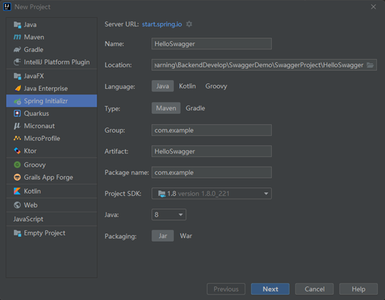
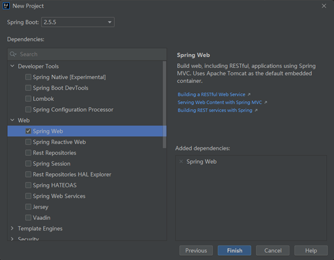
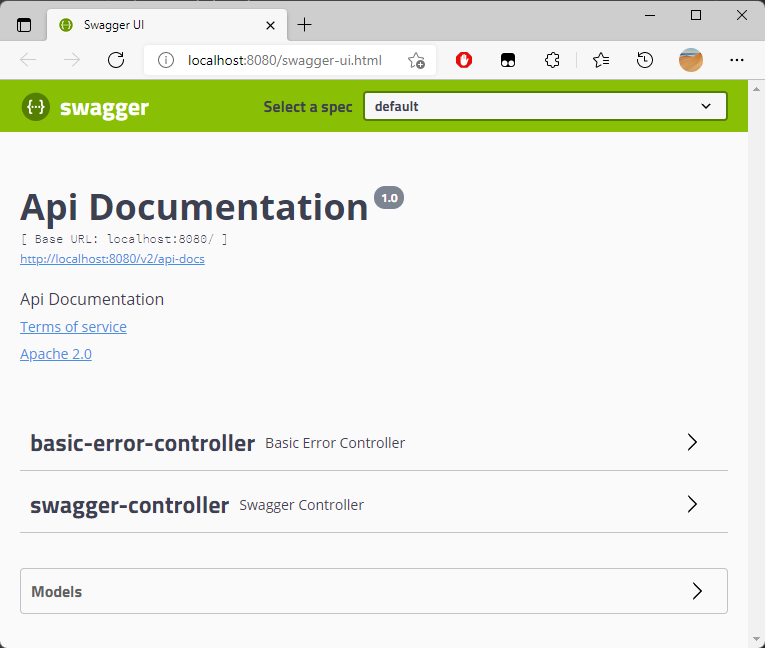
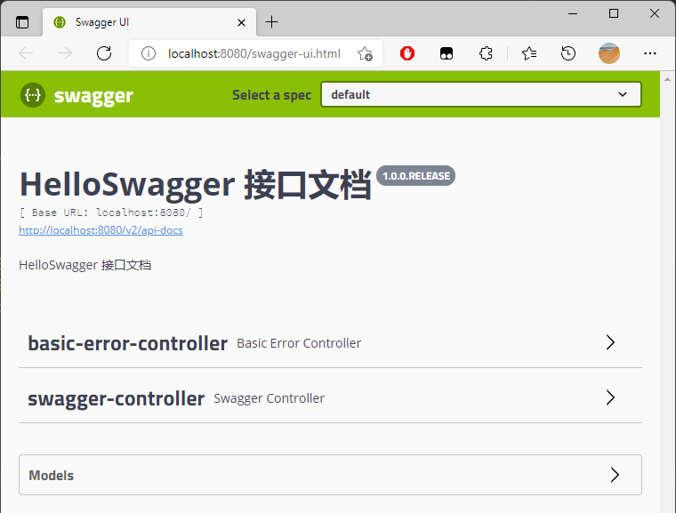
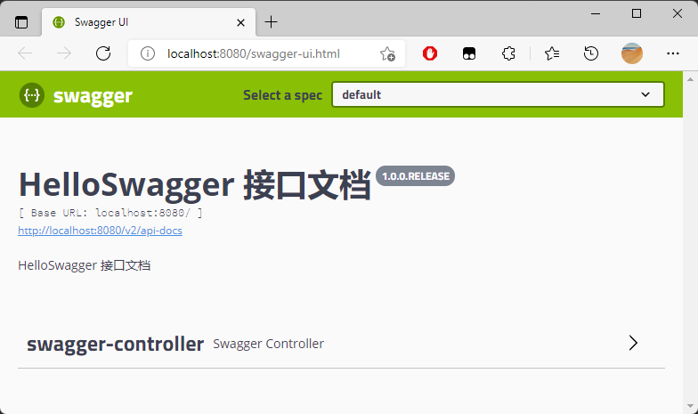
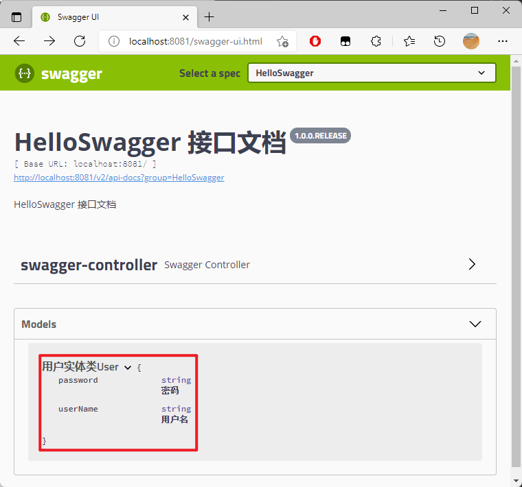

# SpringBoot 集成 Swagger

## 创建工程





## 引入依赖

```xml
<!-- https://mvnrepository.com/artifact/io.springfox/springfox-swagger2 -->
<dependency>
    <groupId>io.springfox</groupId>
    <artifactId>springfox-swagger2</artifactId>
    <version>2.9.2</version>
</dependency>

<!-- https://mvnrepository.com/artifact/io.springfox/springfox-swagger-ui -->
<dependency>
    <groupId>io.springfox</groupId>
    <artifactId>springfox-swagger-ui</artifactId>
    <version>2.9.2</version>
</dependency>
```

## 创建接口

```java
package com.example.controller;

import org.springframework.web.bind.annotation.GetMapping;
import org.springframework.web.bind.annotation.RestController;

/**
 * @author chenzufeng(00018397)
 * @date 2021/10/12
 */
@RestController
public class SwaggerController {
    @GetMapping("/helloSwagger")
    public String helloSwagger() {
        return "Hello Swagger !";
    }
}
```


## 使用 Swagger

```java
package com.example.swagger;

import org.springframework.context.annotation.Configuration;
import springfox.documentation.swagger2.annotations.EnableSwagger2;

/**
 * @author chenzufeng(00018397)
 * @date 2021/10/12
 * Swagger配置：@Configuration - 配置类；@EnableSwagger2 - 开启Swagger2的自动配置
 */
@Configuration
@EnableSwagger2
public class SwaggerConfig {

}
```

访问：[http://localhost:8080/swagger-ui.html](http://localhost:8080/swagger-ui.html) ，可以看到 Swagger 的界面：




# Swagger 配置

## 配置 Swagger 信息

Swagger 实例 Bean 是 Docket，所以通过配置 Docket 实例来配置 Swaggger。

```java
@Configuration
@EnableSwagger2
public class SwaggerConfig {
    /**
     * 配置 Docket 的 Bean 实例
     * @return Docket
     */
    @Bean
    public Docket createRestApi() {
        return new Docket(DocumentationType.SWAGGER_2)
                .apiInfo(apiInfo());
    }

    /**
     * 配置 Swagger 信息：apiInfo
     * @return apiInfo
     */
    private ApiInfo apiInfo() {
        return new ApiInfoBuilder()
                .title("HelloSwagger 接口文档")
                .description("HelloSwagger 的接口文档。")
                .version("1.0.0.RELEASE")
                .build();
    }
}
```

访问：[http://localhost:8080/swagger-ui.html](http://localhost:8080/swagger-ui.html) ，可以看到 Swagger 的界面：



## 配置扫描接口

### RequestHandlerSelectors

```java
@Bean
public Docket createRestApi() {
    return new Docket(DocumentationType.SWAGGER_2)
            .apiInfo(apiInfo())
            // 通过 select()方法，去配置扫描接口
            .select()
            // RequestHandlerSelectors 配置如何扫描接口
            .apis(RequestHandlerSelectors.basePackage("com.example.controller"))
            .build();
}
```

访问：[http://localhost:8080/swagger-ui.html](http://localhost:8080/swagger-ui.html) ，可以看到 Swagger 的界面：



由于配置`根据包的路径扫描接口`，所以只能看到一个类。


除了通过包路径配置扫描接口外，还可以通过`配置其他方式扫描接口`：

```markdown
# 扫描所有，项目中的所有接口都会被扫描到
any() 

# 不扫描接口
none() 

# 通过方法上的注解扫描，如withMethodAnnotation(GetMapping.class)只扫描get请求
withMethodAnnotation(final Class<? extends Annotation> annotation)

# 通过类上的注解扫描，如withClassAnnotation(Controller.class)只扫描有controller注解的类中的接口
withClassAnnotation(final Class<? extends Annotation> annotation)

# 根据包路径扫描接口
basePackage(final String basePackage) 
```


### 配置接口扫描过滤

```java
@Bean
public Docket createRestApi() {
    return new Docket(DocumentationType.SWAGGER_2)
            .apiInfo(apiInfo())
            // 通过 select()方法，去配置扫描接口
            .select()
            // RequestHandlerSelectors 配置如何扫描接口
            .apis(RequestHandlerSelectors.basePackage("com.example.controller"))
            // 配置如何通过path过滤，PathSelectors.ant("/example/**")：只扫描请求以/example开头的接口
            .paths(PathSelectors.any())
            .build();
}
```

这里的可选值还有：

```markdown
# 任何请求都扫描
any()

# 任何请求都不扫描
none()

# 通过正则表达式控制
regex(final String pathRegex) 

# 通过ant()控制
ant(final String antPattern)
```


## 配置 Swagger 开关

通过 enable() 方法配置是否启用 Swagger，如果是 false，Swagger 将不能在浏览器中访问。

```java
@Bean
public Docket createRestApi() {
    return new Docket(DocumentationType.SWAGGER_2)
            .apiInfo(apiInfo())
            // 只能在.select()前添加；配置是否启用Swagger，如果是false，在浏览器将无法访问
            .enable(false)
            .select()
            .apis(RequestHandlerSelectors.basePackage("com.example.controller"))
            .paths(PathSelectors.any())
            .build();
}
```


如何动态配置当项目处于dev 环境时显示 Swagger，处于 uat 环境时不显示：

```java
@Bean
public Docket createRestApi(Environment environment) {

    // 设置要显示的Swagger环境：是否返回dev，spring.profiles.active=dev（org.springframework.core.env）
    Profiles profiles = Profiles.of("dev");
    // 获取项目的环境
    boolean environmentFlag = environment.acceptsProfiles(profiles);

    return new Docket(DocumentationType.SWAGGER_2)
            .apiInfo(apiInfo())
            .groupName("HelloSwagger")
            // 只能在.select()前添加；配置是否启用Swagger，如果是false，在浏览器将无法访问
            .enable(environmentFlag)

            .select()
            .apis(RequestHandlerSelectors.basePackage("com.example.controller"))
            .paths(PathSelectors.any())
            .build();
}
```

配置文件：

```properties
# application.properties
spring.profiles.active=dev

# application-dev.properties
server.port=8081

# application-uat.properties
server.port=8082
```

结果：

```markdown
Tomcat initialized with port(s): 8081 (http)
```

访问：[http://localhost:8081/swagger-ui.html](http://localhost:8080/swagger-ui.html) ，可以看到 Swagger 的界面。

## 配置 API 分组

如果没有配置分组，默认是default。通过groupName()方法即可配置分组：

```java
@Bean
public Docket createRestApi() {
    return new Docket(DocumentationType.SWAGGER_2)
            .apiInfo(apiInfo())
            // 设置 Select a spec
            .groupName("HelloSwagger")
            .select()
            .apis(RequestHandlerSelectors.basePackage("com.example.controller"))
            .paths(PathSelectors.any())
            .build();
}
```

如何配置多个分组？

配置多个分组只需要配置多个docket即可：

```java
@Bean
public Docket docket1(){
   return new Docket(DocumentationType.SWAGGER_2).groupName("group1");
}
@Bean
public Docket docket2(){
   return new Docket(DocumentationType.SWAGGER_2).groupName("group2");
}
@Bean
public Docket docket3(){
   return new Docket(DocumentationType.SWAGGER_2).groupName("group3");
}
```


## 实体配置

### 新建实体类

```java
package com.example.dto;

import io.swagger.annotations.ApiModel;
import io.swagger.annotations.ApiModelProperty;

/**
 * @author chenzufeng
 * @date 2021/10/12
 * @usage User
 */
@ApiModel("用户实体类User")
public class User {
    @ApiModelProperty("用户名")
    private String userName;
    @ApiModelProperty("密码")
    private String password;

    public String getUserName() {
        return userName;
    }

    public void setUserName(String userName) {
        this.userName = userName;
    }

    public String getPassword() {
        return password;
    }

    public void setPassword(String password) {
        this.password = password;
    }

    @Override
    public String toString() {
        return "User{" +
                "userName='" + userName + '\'' +
                ", password='" + password + '\'' +
                '}';
    }
}
```

### 添加接口

```java
package com.example.controller;

import com.example.dto.User;
import org.springframework.web.bind.annotation.GetMapping;
import org.springframework.web.bind.annotation.PostMapping;
import org.springframework.web.bind.annotation.RestController;

/**
 * @author chenzufeng
 * @date 2021/10/12
 * @usage 接口
 */
@RestController
public class SwaggerController {
    @GetMapping("/helloSwagger")
    public String helloSwagger() {
        return "Hello Swagger !";
    }

    /**
     * 只要这个实体在请求接口的返回值中（即使是泛型），都能映射到实体项
     * @return User
     */
    @PostMapping("/getUser")
    public User getUser() {
        return new User();
    }
}
```

### 测试

访问：[http://localhost:8081/swagger-ui.html](http://localhost:8080/swagger-ui.html) ，可以看到 Swagger 的界面：



# 常用注解

Swagger 的所有注解定义在`io.swagger.annotations`包下：

| **Swagger注解**                                         | **简单说明**                                         |
| ------------------------------------------------------- | ---------------------------------------------------- |
| @Api(tags = "xxx模块说明")                              | 作用在模块类上                                       |
| @ApiOperation("xxx接口说明")                            | 作用在接口方法上                                     |
| @ApiModel("xxxPOJO说明")                                | 作用在模型类上：如VO、BO                             |
| @ApiModelProperty(value = "xxx属性说明", hidden = true) | 作用在类方法和属性上，hidden设置为true可以隐藏该属性 |
| @ApiParam("xxx参数说明")                                | 作用在参数、方法和字段上，类似@ApiModelProperty      |

```java
package com.example.controller;

import com.example.dto.User;
import io.swagger.annotations.ApiOperation;
import io.swagger.annotations.ApiParam;
import org.springframework.web.bind.annotation.*;

/**
 * @author chenzufeng
 * @date 2021/10/12
 * @usage 接口
 */
@RestController
public class SwaggerController {
    @GetMapping("/helloSwagger")
    public String helloSwagger() {
        return "Hello Swagger !";
    }

    /**
     * 只要这个实体在请求接口的返回值中（即使是泛型），都能映射到实体项
     * @return User
     */
    @PostMapping("/getUser")
    public User getUser(@RequestBody User user) {
        return user;
    }

    @ApiOperation("用户你好")
    @GetMapping("/hello")
    public String hello(@ApiParam("传递的参数为用户名") @RequestParam String userName) {
        return "Hello " + userName;
    }
}
```

# 美化 Swagger

添加依赖：

```xml
<!-- https://mvnrepository.com/artifact/com.github.xiaoymin/knife4j-spring-boot-starter -->
<dependency>
    <groupId>com.github.xiaoymin</groupId>
    <artifactId>knife4j-spring-boot-starter</artifactId>
    <version>2.0.9</version>
</dependency>
```

访问：[http://localhost:8081/doc.html#/home](http://localhost:8081/doc.html#/home) ，可以看到 Swagger 的界面。